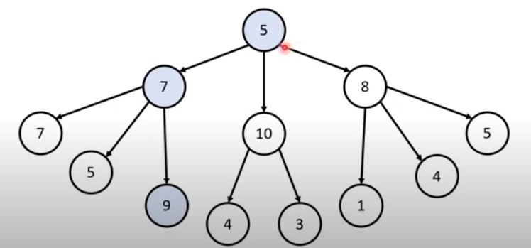
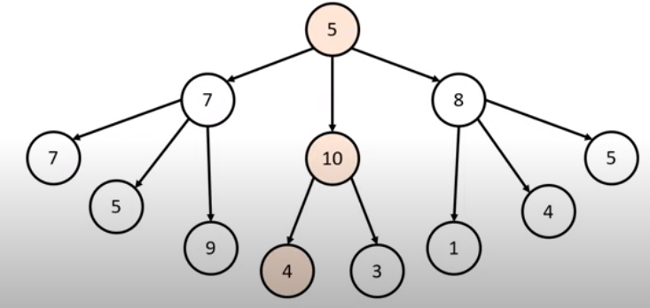
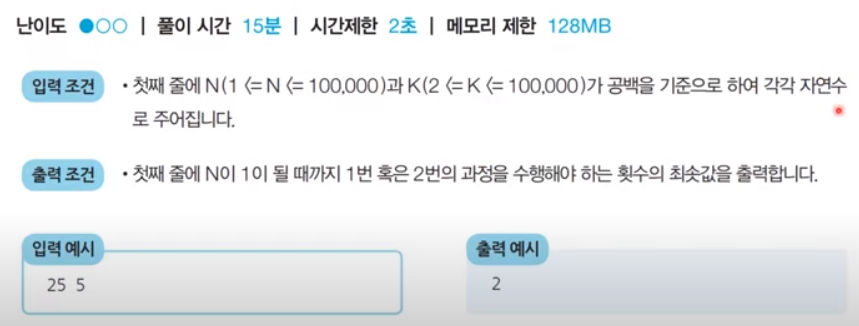
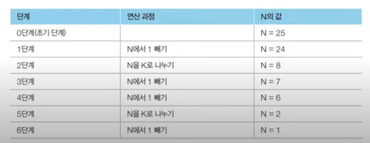
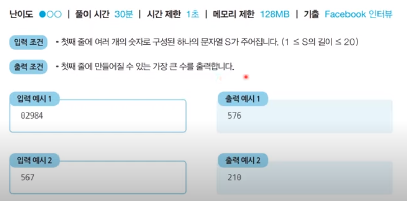

# 코딩 테스트 노트 with Python

## 3. 그리디 알고리즘

### 3.1 그리디 알고리즘
- 그리디 알고리즘(탐욕법)은 **현재 상황에서 지금 당장 좋은 것만 고르는 방법**을 의미합니다.
- 일반적인 그리디 알고리즘은 문제를 풀기 위한 최소한의 아이디어를 떠올릴 수 있는 능력을 요구합니다.
- 그리디 해법은 그 정당성 분석이 중요합니다.
  - 단순히 가장 좋아 보이는 것을 반복적으로 선택해도 최적의 해를 구할 수 있는지 검토합니다.
- [문제 상황] 루트 노드부터 시작하여 거쳐 가는 노드 값의 합을 최대로 만들고 싶습니다.
  - Q. 최적의 해는 무엇인가요?

  </img> 
  - Q. 단순히 매 상황에서 가장 큰 값만 고른다면 어떻게 될까요?

  </img> 

- 일반적인 상황에서 그리디 알고리즘은 최적의 해를 보장할 수 없을 때가 많습니다.
- 하지만 코딩 테스트에서의 대부분의 그리디 문제는 **탐욕법으로 얻은 해가 최적의 해가 되는 상황에서, 이를 추론**할 수 있어야 풀리도록 출제됩니다.

### 3.2 그리디 알고리즘 문제 : 거스름 돈
#### [문제 설명]
- 당신은 음직점의 계산을 도와주는 점원입니다. 카운터에는 거스름돈으로 사용할 500원, 100원, 50원, 10원짜리 동전이 무한히 존재한다고 가정합니다. 손님에게 거슬러 주어야 할 돈이 N원일 때 **거슬러 주어야할 동전의 최소 개수**를 구하세요. 단, 거슬러 줘야할 돈 N은 항상 10의 배수입니다.

#### [아이디어]
- 최적의 해를 빠르게 구하기 위해서는 가장 큰 화폐 단위부터 돈을 거슬러 주면됩니다.
- N원을 거슬러 줘야할 때, 가장 먼저 500원으로 거슬러 줄 수 있을 만큼 거슬러 줍니다.
  - 이후에 100원, 50원, 10원짜리 동전을 차례대로 거슬러 줄 수 있을 만큼 거슬러 주면 됩니다.
- N = 1,260일 때의 예시를 확인해 봅니다.
  |화폐 단위|500|100|50|10|
  |:---:|:---:|:---:|:---:|:---:|
  |손님이 받은 개수|2|2|1|1

#### [정당성 분석]
- 가장 큰 화폐 단위부터 돈을 거슬러 주는 것이 최적의 해를 보장하는 이유는 무엇일까요?
  - 가지고 있는 동전 중에서 **큰 단위가 항상 작은 단위의 배수이므로 작은 단위의 동전들을 종합해 다른 해가 나올 수 없기 때문**입니다.
- 만약에 800원을 거슬러 주어야 하는데 화폐 단위가 500, 400, 100원이라면 어떻게 될까요?
- 그리디 알고리즘 문제에서는 이처럼 **문제 풀이를 위한 최소한의 아이디어를 떠올리고 이것이 정당한지 검토**할 수 있어야 합니다.

#### [Code]
<pre>
<code>
n = 1260
count = 0

# 큰 단위의 화폐부터 차례대로 확인하기
array = [500, 100, 50, 10]

for coin in array:
    count += n//coin    # 해당 화폐로 거슬러 줄 수 있는 동전의 개수 세기
    n %= coin

print(count)
</code>
</pre>

#### [분석]
- 화폐의 종류가 K라고 할 때, 소스코드의 시간 복잡도는 O(K)입니다.
- 이 알고리즘의 시간 복잡도는 거슬러줘야하는 금액과는 무관하며, 동전의 총 종류에만 영향을 받습니다.

---

### 3.3 그리디 알고리즘 문제 : 1이 될 때까지
#### [문제 설명]
- 어떠한 수 **N이 1이 될 때까지** 다음의 두 과정 중 하나를 반복적으로 선택하여 수행하려고 합니다. 단, 두 번째 연산은 N이 K로 나누어 떨어질 때만 선택할 수 있습니다.

  1. N에서 1을 뺍니다.
  2. N을 K로 나눕니다.

- 예를 들어 N이 17, K가 4라고 가정합시다. 이때 1번의 과정을 한 번 수행하면 N은 16이 됩니다. 이후에 2번의 과정을 두 번 수행하면 N은 1이됩니다. 결과적으로 이 경우 전체 과정을 실행한 횟수는 3이됩니다. 이는 N을 1로 만드는 최소 횟수입니다.

- N과 K가 주어질 때 N이 1이 될 때까지 1번 혹은 2번의 과정을 수행해야 하는 최소 횟수를 구하는 프로그램을 작성하세요.
#### [문제 조건]
</img> 

#### [아이디어]
- 주어진 **N에 대하여 최대한 많이 나누기를 수행**하면 됩니다.
- N의 값을 줄일 때 **2 이상의 수로 나누는 작업이 1을 빼는 작업**보다 수를 훨씬 많이 줄일 수 있습니다.
- 예를 들어 N = 25, K = 3일 때는 다음과 같습니다.
  
  </img> 

#### [정당성 분석]
- **가능하면 최대한 많이 나누는 작업**이 최적의 해를 항상 보장할 수 있을까요?
- N이 아무리 큰 수여도, K로 계속 나눈다면 기하급수적으로 빠르게 줄일 수 있습니다.
- 다시 말해 K가 2이상이기만 하면, K로 나눈 것이 1을 빼는 것보다 항상 빠르게 N을 줄일 수 있습니다.
  - 또한 N은 항상 1에 도달하게 됩니다.(최적의 해 성립)

#### [Code]
- O(logN) 시간 복잡도
  - **빼기 연산을 반복문 한 회에 몰아서 할 수 있도록 최적화**
<pre>
<code>
# N, K을 공백을 기준으로 구분하여 입력 받기
n, k = map(int, input().split())

result = 0

while True:
    # N이 K로 나누어 떨어지는 수가 될 때까지 빼기
    target = (n // k) * k
    result += (n - target)
    n = target

    # N이 K보다 작을 때 (더 이상 나눌 수 없을 때) 반복문 탈출
    if n < k:
        break

    # K로 나누기
    result += 1
    n //= k

# 마지막으로 남은 수에 대하여 1씩 빼기
result += (n - 1)
print(result)
</code>
</pre>
- O(N) 시간 복잡도
  - 단순 연산
<pre>
<code>
N, K = map(int, input().split())
cnt = 0

while N != 1:
    if N % K == 0:
        N /= K
        cnt += 1
    else :
        N -= 1
        cnt += 1
print(cnt)
</code>
</pre>

---

### 3.4 그리디 알고리즘 문제 : 곱하기 혹은 더하기
#### [문제 설명]
- 각 자리가 숫자(0부터 9)로만 이루어진 문자열 S가 주어졌을 때, 왼쪽부터 오른쪽으로 하나씩 모든 숫자를 확인하며 숫자 사이에 'x' 혹은 '+' 연산자를 넣어 결과적으로 **만들어질 수 있는 가장 큰 수를 구하는 프로그램**을 작성하세요. 단, +보다 x를 먼저 계산하는 일반적인 방식과는 달리, __모든 연산은 왼쪽에서부터 순서대로__ 이루어진다고 가정합시다.
- 예를 들어 02984라는 문자로 만들 수 있는 가장 큰 수는 ((((0 + 2) x 9) x 8) x 4) = 576입니다. 또한 만들어질 수 있는 가장 큰 수는 항상 20억 이하의 정수가 되도록 입력이 주어집니다.

#### [문제 조건]
</img> 

#### [아이디어]
- 대부분의 경우 '+'보다는 'x'가 더 값을 크게 만듭니다.
  - 예를 들어 5 + 6 = 11이고, 5 x 6 = 30입니다.
- 다만 두 수 중에서 하나라도 '0' 혹은 '1'인 경우, 곱하기보다 더하기를 수행하는 것이 효율적입니다.
- 따라서 **두 수에 대하여 연산을 수행할 때, 두 수 중에서 하나라도 1이하인 경우에는 더하며, 두 수가 모두 2 이상인 경우에는 곱하면 정답**입니다.

#### [정당성 분석]
- 
#### [Code]
<pre>
<code>
data = input()

# 첫 번째 문자를 숫자로 변경하여 대입
result = int(data[0])

for i in range(1, len(data)):
    # 두 수 중에서 하나라도 '0' 혹은 '1'인 경우, 곱하기보다는 더하기 수행
    num = int(data[i])
    if num <= 1 or result <= 1:
        result += num
    else :
        result *= num

print(result)
</code>
</pre>

---

### 3.5 그리디 알고리즘 문제 : -
#### [문제 설명]

#### [문제 조건]

#### [아이디어]

#### [정당성 분석]
- 
#### [Code]
<pre>
<code>

</code>
</pre>