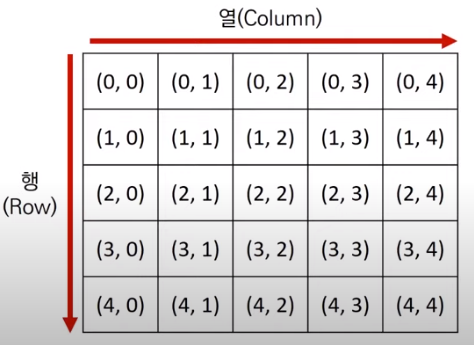
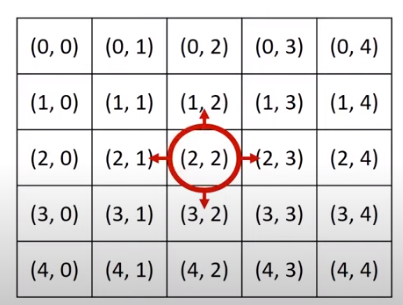
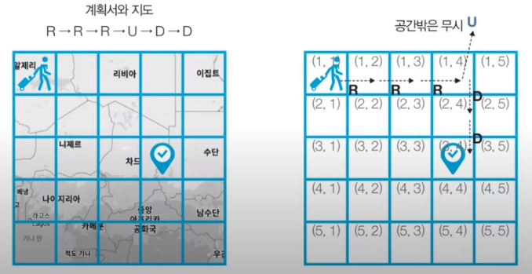
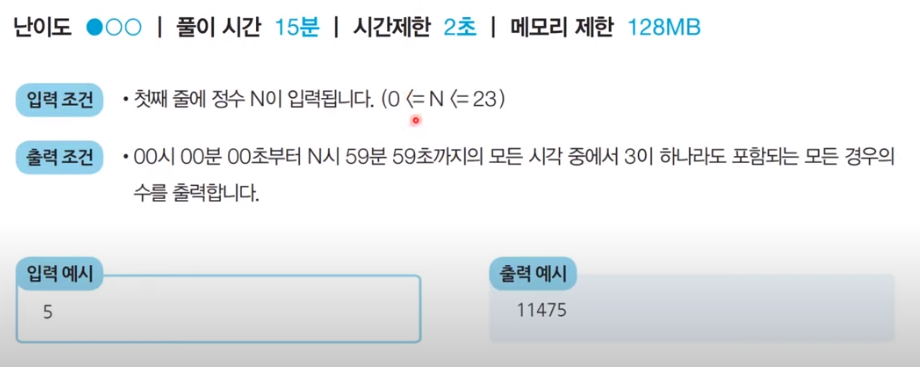
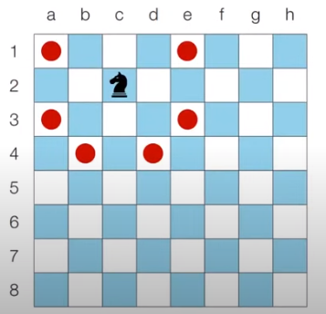
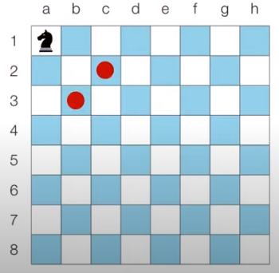
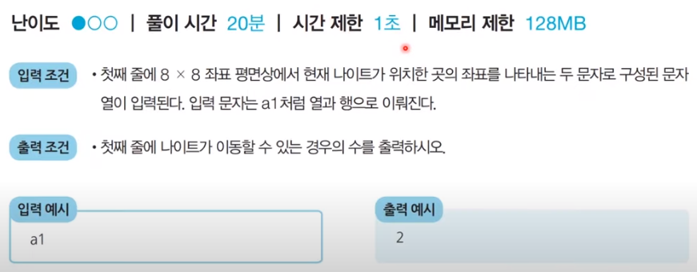
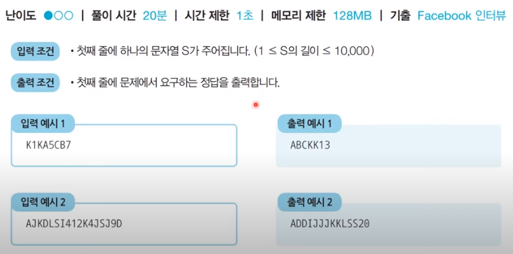

# 코딩 테스트 노트 with Python

## 4. 구현: 시뮬레이션과 완점탐색

### 4.1 구현(Implementation)
- 구현이란, **머릿속에 있는 알고리즘을 소스코드로 바꾸는 과정**입니다.

- 흔히 알고리즘 대회에서 구현 유형의 문제란 무엇을 의미할까요?
  - **풀이를 떠올리는 것은 쉽지만 소스코드로 옮기기 어려운 문제를 지칭합니다.**
- 구현 유형의 예시는 다음과 같습니다.
  - 알고리즘은 간단한데 코드가 지나칠 만큼 길어지는 문제
  - 실수 연산을 다루고, 특정 소수점 자리까지 출력해야 하는 문제
  - 문자열을 특정한 기준에 따라서 끊어 처리해야 하는 문제
  - 적절한 라이브러리를 찾아서 사용해야 하는 문제

- 일반적으로 알고리즘 문제에서의 2차원 공간은 **행렬(Matrix)** 의 의미로 사용됩니다.

  </img> 

<pre>
  <code>
  for i in range(5):
    for j in range(5):
        print('(', i, ',', j, ')', end=' ')
    print()
  </code>
</pre>

- 시뮬레이션 및 완전 탐색 문제에서는 2차원 공간에서의 방향 벡터가 자주 활용됩니다.

  </img> 

<pre>
  <code>
   # 동, 북, 서, 남
   ds = ['동', '북', '서', '남']
   dx = [0, -1, 0, 1]
   dy = [1, 0, -1, 0]

   # 현재 위치
   x, y = 2, 2

   for i in range(4):
       # 다음 위치
       nx = x + dx[i]
       ny = y + dy[i]
       print(ds[i] + '(', nx, ny,')')
  </code>
</pre>
---
### 4.2 구현 문제 : 상하좌우
#### [문제 설명]
- 여행가 A는 N x N 크기의 정사각형 공간 위에 서 있습니다. 이 공간은 1 X 1크기의 정사각형으로 나누어져 있습니다. 가장 왼쪽 위 좌표는 (1, 1)이며, 가장 오른쪽 아래 좌표는 (N, N)에 해당합니다. 여행가 A는 **상, 하, 좌, 우 방향으로 이동**할 수 있으며, 시작 좌표는 항상 (1, 1)입니다. 우리 앞에는 여행가 A가 이동할 계획이 적힌 계획서가 놓여 있습니다.

- 계획서에는 하나의 줄에 띄어쓰기를 기준으로 하여 L, R, U, D 중 하나의 문자가 반복적으로 젹혀 잇습니다. 각 문자의 의미는 다음과 같습니다.
  - L : 왼쪽으로 한 칸 이동
  - R : 오른쪽으로 한 칸 이동
  - U : 위로 한 칸 이동
  - D : 아래로 한 칸 이동

- 이때 여행가 A가 N x N 크기의 정사각형 **공간을 벗어나는 움직임은 무시**됩니다. 다음은 N = 5인 지도와 계획서입니다.
  </img> 

#### [문제 조건]
</img> 

#### [아이디어]
- 이 문제는 요구사항대로 충실히 구현하면 되는 문제입니다.
- 일련의 명령에 따라서 개체를 차례대로 이동시킨다는 점에서 **시뮬레이션(Simulation) 유형**으로도 분류되며 구현이 중요한 대표적인 문제 유형입니다.
  - 다만, 알고리즘 교재나 문제 풀이 사이트에 따라서 다르게 일컬을 수 있으므로, 코딩 테스트에서의 시뮬레이션 유형, 구현 유형, 완전 탐색 유형은 서로 유사한 점이 많다는 정도로만 기억합시다.

#### [Code]
<pre>
<code>
# N 입력 받기
n = int(input())
x, y = 1, 1
plans = input().split()

# L, R, U, D에 따른 이동 방향
dx = [0, 0, -1, 1]
dy = [-1, 1, 0, 0]
move_types = ['L', 'R', 'U', 'D']

# 이동 게획을 하나씩 확인하기
for plan in plans:
    # 이동 후 좌표 구하기
    for i in range(len(move_types)):
        if plan == move_types[i]:
            nx = x + dx[i]
            ny = y + dy[i]

    # 공간을 벗어나는 경우 무시
    if nx < 1 or ny < 1 or nx > n or ny > n:
        continue
    
    # 이동 수행
    x, y = nx, ny
print(x, y)
</code>
</pre>

---

### 4.3 구현 문제 : 시각
#### [문제 설명]
- 정수 N이 입력되면 00시 00분 00초부터 N시 59분 59초까지의 모든 시각 중에서 3이 하나라도 포함되는 모든 경우의 수를 구하는 프로그램을 작성하세요. 예를 들어 1을 입력했을 때 다음은 3이 하나라도 포함되어 있으므로 **세어야 하는 시각**입니다.
  - 00시 00분 03초
  - 00시 13분 30초
- 반면에 다음은 3이 하나도 포함되어 있지 않으모 **세면 안 되는 시각**입니다.
  - 00시 02분 55초
  - 01시 27분 45초

#### [문제 조건]
</img> 

#### [아이디어]
- 이 문제는 가능한 모든 시각의 경우를 하나씩 모두 세서 풀 수 있는 문제입니다.
- 하루는 86,400초이므로, 00시 00분 00초부터 23시 59분 59초까지의 모든 경우는 86,400가지 입니다.
  - 24 * 60 * 60 = 86,400
- 따라서 단순히 시각을 1씩 증가시키면서 3이 하나라도 포함되어 있는지를 확인하면 됩니다.
- 이러한 유형은 **완전 탐색(Brute Forcing)** 문제 유형이라고 불립니다.
  - **가능한 경우의 수를 모두 검사해보는 탐색 방법**을 의미합니다.

#### [Code]
<pre>
<code>
  # H 입력 받기
h = int(input())

count = 0

for i in range(h + 1):
    for j in range(60):
        for k in range(60):
            # 매 시각 안에 '3'이 포함되어 있다면 카운트 증가
            timebs = str(i) + str(j) + str(k)
            if '3' in timebs:
                count += 15
print(count)
</code>
</pre>

#### [분석]
- 

---

### 4.4 구현 문제 : 왕실의 나이트
#### [문제 설명]
- 행복 왕국의 왕실 정원은 체스판과 같은 8 X 8 좌표 평면입니다. 왕실 정원의 특정한 한 칸에 나이트가 서있습니다. 나이트는 매우 충성스러운 신하로서 매일 무술을 연마합니다.

- 나이트는 말을 타고 있기 때문에 이동을 할 때는 L자 형태로만 이동할 수 있으며 정원 밖으로는 나갈 수 없습니다.

- 나이트는 특정 위치에서 다음과 같은 2가지 경우로 이동할 수 있습니다.
  - 수평으로 두 칸 이동한 뒤에 수직으로 한 칸 이동하기
  - 수직으로 두 칸 이동한 뒤에 수평으로 한 칸 이동하기

- 이처럼 8 x 8 좌표 평면상에서 나이트의 위치가 주어졌을 때 나이트가 이동할 수 있는 경우의 수를 출력하는 프로그램을 작성하세요. 왕실의 정원에서 행 위치를 표현할 때는 1부터 8로 표현하며, 열 위치를 표현할 때는 a부터 h로 표현합니다.
  - c2에 있을 때 이동할 수 있는 경우의 수는 6가지 입니다.
  </img> 
  - a1에 있을 때 이동할 수 있는 경우의 수는 2가지입니다.
  </img> 

#### [문제 조건]
</img> 

#### [아이디어]
- 요구사항대로 충실히 구현하면 되는 문제입니다.
- 나이트의 8가지 경로를 하나씩 확인하며 각 위치로 이동이 가능한지 확인합니다.
  - 리스트를 이용하여 8가지 방향에 대한 방향 벡터를 정의합니다.

#### [Code]
<pre>
<code>
# 현재 나이트의 위치 입력받기
input_data = input()
row = int(input_data[1])
column = int(ord(input_data[0]) - int(ord('a'))) + 1

# 나이트가 이동할 수 있는 8가지 방향 정의
steps = [(-2, -1), (-1, -2), (1, -2), (2, -1), (2, 1), (1, 2), (-1, 2), (-2, 1)]

# 8가지 방향에 대하여 각 위치로 이동이 가능한지 확인
result = 0
for step in steps:
    # 이동하고자 하는 위치 확인
    next_row = row + step[0]
    next_column = column + step[1]
    # 해당 위치로 이동이 가능하다면 카운트 증가
    if next_row >= 1 and next_row <= 8 and next_column >= 1 and next_column <= 8:
        result += 1

print(result)
</code>
</pre>

---

### 4.5 구현 문제 : 문자열 재정렬
#### [문제 설명]
- 알파벳 대문자와 숫자(0~9)로만 구성된 문자열이 입력으로 주어집니다. 이때 모든 알파벳을 오름차순으로 정렬하여 이어서 출력한 뒤에, 그 뒤에 모든 숫자를 더한 값을 이어서 출력합니다.
- 예를 들어 K1KA5CB7이라는 값이 들어오면 ABCKK13을 출력합니다.

#### [문제 조건]
</img> 

#### [아이디어]
- 요구사항대로 충실히 구현하면 되는 문제입니다.
- 문자열이 입력되었을 때 문자를 하나씩 확인합니다.
  - 숫자인 경우 따로 합계를 계산합니다.
  - 알파벳인 경우 별도의 리스트에 저장합니다.
- 결과적으로 리스트에 저장된 알파벳을 정렬해 출력하고, 합계를 뒤에 붙여 출력하면 정답입니다.

#### [Code]
<pre>
<code>
data = input()
result = []
value = 0

# 문자를 하나씩 확인하며
for x in data:
    # 알파벳인 경우 결과 리스트에 삽입
    if x.isalpha():
        result.append(x)
    # 숫자는 따로 더하기
    else :
        value += int(x)

# 알파벳을 오름차순으로 정렬
result.sort()

# 숫자가 하나라도 존재하는 경우 가장 뒤에 삽입
if value != 0:
    result.append(str(value))

# 최종 결과 출력(리스트를 문자열로 변환하여 출력)
print(''.join(result))
</code>
</pre>