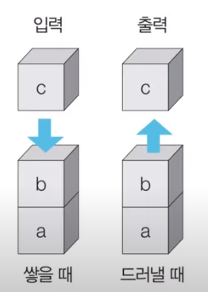
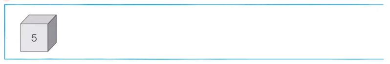
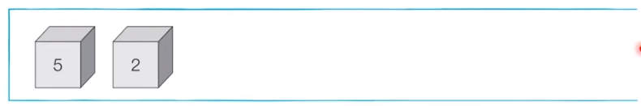
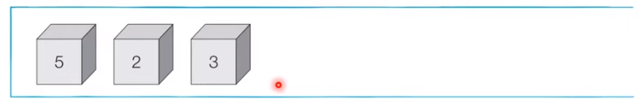
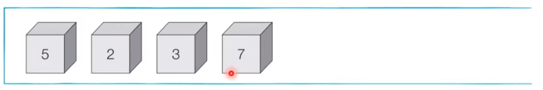
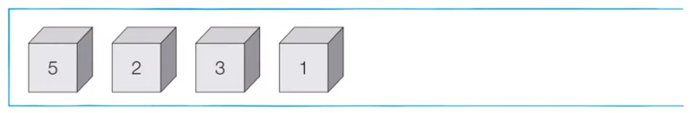
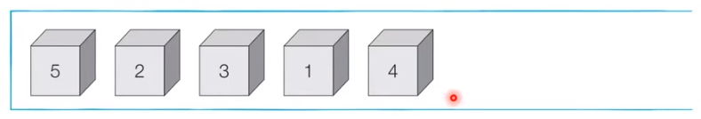
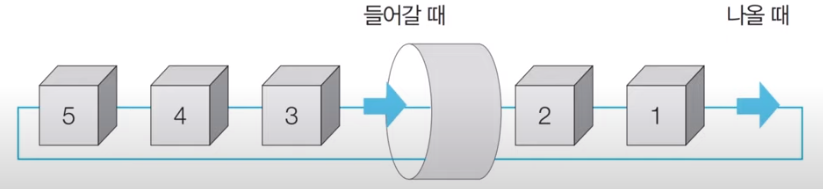
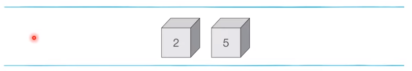
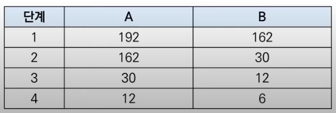

# 코딩 테스트 노트 with Python

## 5. 그래프 탐색 알고리즘: DFS / BFS

### 5.1 그래프 탐색 알고리즘: DFS / BFS
- 탐색(Search)이란 많은 양의 데이터 중에서 **원하는 데이터를 찾는 과정**을 말합니다.
- 대표적인 그래프 탐색 알고리즘으로는 DFS와 BFS가 있습니다.
- **DFS/BFS는 코딩 테스트에서 매우 자주 등장하는 유형**이므로 반드시 숙지해야합니다.

### 5.2 스택 자료구조
- 먼저 들어 온 데이터가 나중에 나가는 형식(선입후출)의 자료구조입니다.
- 입구와 출구가 동일한 형태로 스택을 시각화할 수 있습니다.

  </img> 

- **삽입(5)** - 삽입(2) - 삽입(3) - 삽입(7) - 삭제() - 삽입(1) - 삽입(4) - 삭제()

  </img> 
- **삽입(5)** - **삽입(2)** - 삽입(3) - 삽입(7) - 삭제() - 삽입(1) - 삽입(4) - 삭제()

  </img> 
  - **삽입(5)** - **삽입(2)** - **삽입(3)** - 삽입(7) - 삭제() - 삽입(1) - 삽입(4) - 삭제()

  </img> 
  - **삽입(5)** - **삽입(2)** - **삽입(3)** - **삽입(7)** - 삭제() - 삽입(1) - 삽입(4) - 삭제()

  </img> 
    - **삽입(5)** - **삽입(2)** - **삽입(3)** - **삽입(7)** - **삭제()** - 삽입(1) - 삽입(4) - 삭제()

  </img> 
  - **삽입(5)** - **삽입(2)** - **삽입(3)** - **삽입(7)** - **삭제()** - **삽입(1)** - 삽입(4) - 삭제()

  </img> 
    - **삽입(5)** - **삽입(2)** - **삽입(3)** - **삽입(7)** - **삭제()** - **삽입(1)** - **삽입(4)** - 삭제()

  </img> 
    - **삽입(5)** - **삽입(2)** - **삽입(3)** - **삽입(7)** - **삭제()** - **삽입(1)** - **삽입(4)** - **삭제()**

  </img> 

<pre>
<code>
stack = []

# 삽입(5) - 삽입(2) - 삽입(3) - 삽입(7) - 삭제() - 삽입(1) - 삽입(4) - 삭제()
stack.append(5)
stack.append(2)
stack.append(3)
stack.append(7)
stack.pop()
stack.append(1)
stack.append(4)
stack.pop()

print(stack[::-1])  # 최상단 원소부터 출력
print(stack)        # 최하단 원소부터 출력
</code>
</pre>
실행 결과
<pre>
<code>
[1, 3, 2, 5]
[5, 2, 3, 1]
</code>
</pre>

### 5.3 큐 자료구조
- 먼저 들어 온 데이터가 먼저 나가는 형식(선입선출)의 자료구조입니다.

- 큐는 입구와 출구가 모두 뚫려 있는 터널과 같은 형태로 시각화 할 수 있습니다.

  </img> 

- 삽입(5) - 삽입(2) - 삽입(3) - 삽입(7) - 삭제() - 삽입(1) - 삽입(4) - 삭제()

  </img> 

- **삽입(5)** - 삽입(2) - 삽입(3) - 삽입(7) - 삭제() - 삽입(1) - 삽입(4) - 삭제()

  </img> 
- **삽입(5)** - **삽입(2)** - 삽입(3) - 삽입(7) - 삭제() - 삽입(1) - 삽입(4) - 삭제()

  </img> 
  - **삽입(5)** - **삽입(2)** - **삽입(3)** - 삽입(7) - 삭제() - 삽입(1) - 삽입(4) - 삭제()

  </img> 
  - **삽입(5)** - **삽입(2)** - **삽입(3)** - **삽입(7)** - 삭제() - 삽입(1) - 삽입(4) - 삭제()

  </img> 
    - **삽입(5)** - **삽입(2)** - **삽입(3)** - **삽입(7)** - **삭제()** - 삽입(1) - 삽입(4) - 삭제()

  </img> 
  - **삽입(5)** - **삽입(2)** - **삽입(3)** - **삽입(7)** - **삭제()** - **삽입(1)** - 삽입(4) - 삭제()

  </img> 
    - **삽입(5)** - **삽입(2)** - **삽입(3)** - **삽입(7)** - **삭제()** - **삽입(1)** - **삽입(4)** - 삭제()

  </img> 
    - **삽입(5)** - **삽입(2)** - **삽입(3)** - **삽입(7)** - **삭제()** - **삽입(1)** - **삽입(4)** - **삭제()**

  </img> 

<pre>
<code>
from collections import deque

# 큐(Queue) 구현을 위해 deque 라이브러리 사용
queue = deque()

# 삽입(5) - 삽입(2) - 삽입(3) - 삽입(7) - 삭제() - 삽입(1) - 삽입(4) - 삭제()
queue.append(5)
queue.append(2)
queue.append(3)
queue.append(7)
queue.popleft()
queue.append(1)
queue.append(4)
queue.popleft()

print(queue)    # 먼저 들어온 순서대로 출력
queue.reverse()  # 역순으로 바꾸기
print(queue)    # 나중에 들어온 원소부터 출력
</code>
</pre>
실행 결과
<pre>
<code>
deque([3, 7, 1, 4])
deque([4, 1, 7, 3])
</code>
</pre>

### 5.4 재귀 함수
- 재귀 함수(Recursive Function)란 자기 자신을 다시 호출하는 함수를 의미합니다.
- 단순한 형태의 재귀 함수 예제
  - '재귀 함수를 호출합니다.'라는 문자열을 무한히 출력합니다.
  - 어느정도 출력하다가 최대 재귀 깊이 초과 메시지가 출력됩니다.
  <pre>
  <code>
  def recursive_function():
      print('재귀 함수를 호출합니다.')
      recursive_function()

  recursive_function()
  </code>
  </pre>

- 재귀 함수를 문제 풀이에서 사용할 때는 재귀 함수의 종료 조건을 반드시 명시해야 합니다.
- 종료 조건을 제대로 명시하지 않으면 함수가 무한히 호출될 수 있습니다.
  - **종료 조건**을 포함한 재귀 함수 예제
  <pre>
  <code>
  def recursive_function(i):
      # 100번째 호출을 했을 때 종료되도록 종료 조건 명시
      if i == 100:
          return

      print(i, '번째 재귀 함수에서', i+1, '번째 재귀함수를 호출합니다.')
      recursive_function(i+1)
      print(i, '번째 재귀함수를 종료합니다.')

  recursive_function(1)
  </code>
  </pre>

### 5.5 예제 1 : 팩토리얼
- n! = 1 X 2 X 3 X ... X (n-1) X n
- 수학적으로 0!과 1!의 값은 1입니다.
<pre>
<code>
# 반복적으로 구현한 n!
def factorial_iterative(n):
    result = 1
    # 1부터 n까지의 수를 차례대로 곱하기
    for i in range(1, n+1):
        result *= i
    return result
    
# 재귀적으로 구현한 n!
def factorial_recursive(n):
    if n <= 1:  # n이 1이하인 경우 1을 반환 : 종료 조건
        return 1
    # n! = n * (n-1)!를 그대로 코드로 작성
    return n * factorial_recursive(n - 1)

# 각각의 방식으로 구현한 n! 출력 (ex. n=5)
print('반복적으로 구현 : ', factorial_iterative(5))
print('재귀적으로 구현 : ', factorial_recursive(5))
</code>
</pre>
실행결과
<pre>
<code>
반복적으로 구현 :  120
재귀적으로 구현 :  120
</code>
</pre>

### 5.6 예제 2 : 최대공약수 계산(유클리드 호제법)
- 두 개의 자연수에 대한 최대공약수를 구하는 대표적인 알고리즘으로는 유클리드 호제법이 있습니다.
- **유클리드 호제법**
  - 두 자연수 A, B에 대하여 (A > B) A를 B로 나눈 나머지를 R이라고 합시다.
  - 이때 **A와 B의 최대공약수는 B와 R의 최대공약수**와 같습니다.
- 유클리트 호제법의 아이디어를 그대로 재귀 함수로 작성할 수 있습니다.
  - 예시 : GCD(192, 162)

    </img> 

<pre>
<code>
def GCD_EUCLIDEAN(a, b):
    
    if a % b == 0:
        return b
    else: 
        return GCD_EUCLIDEAN(b, a % b)

print(GCD_EUCLIDEAN(192, 162))
</code>
</pre>
실행 결과
<pre>
<code>
6
</code>
</pre>

### 5.7 재귀 함수 사용의 유의 사항
- 재귀 함수를 잘 활용하면 복잡한 알고리즘을 간결하게 작성할 수 있습니다.
  - 단, 오히려 다른 사람이 이해하기 어려운 형태의 코드가 될 수도 있으므로 신중하게 사용해야 합니다.
- 모든 **재귀 함수는 반복문을 이용하여 동일한 기능을 구현**할 수 있습니다.
- 재귀 함수가 반복문보다 유리한 경우도 있고 불리한 경우도 있습니다.
- 컴퓨터가 함수를 연속적으로 호출하면 컴퓨터 메모리 내부의 스택 프레임에 쌓입니다.
  - 그래서 스택을 사용해야할 때 구현상 **스택 라이브러리 대신 재귀함수**를 이용하는 경우가 많습니다.
