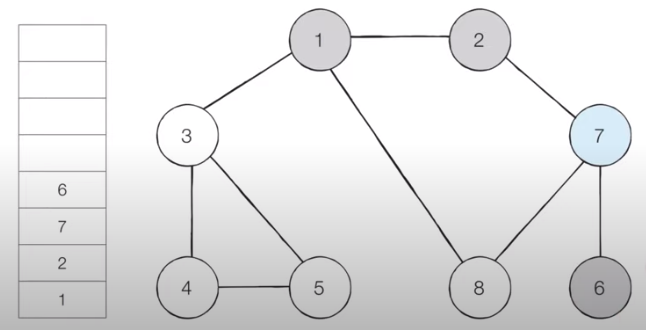
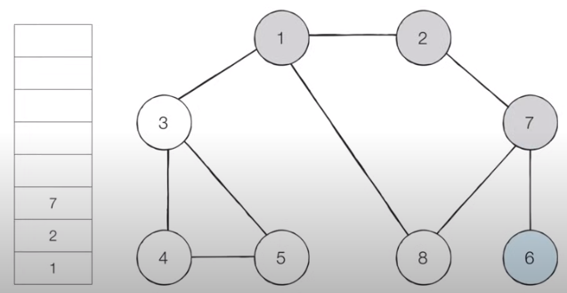

# 코딩 테스트 노트 with Python

## 5. 그래프 탐색 알고리즘: DFS / BFS

### 5.8 DFS(Depth-First Search)
- DFS는 **깊이 우선 탐색**이라고 부르며 그래프에서 깊은 부분을 우선적으로 탐색하는 알고리즘입니다.
- DFS는 **스택 자료구조(혹은 재귀 함수)를 이용**하며, 구체적인 동작 과정은 다음과 같습니다.
  1. 탐색 시작 노드를 스택에 삽입하고 방문 처리를 합니다.
  2. 스택의 최상단 노드에 방문하지 않은 인접한 노드가 하나라도 있으면 그 노드를 스택에 넣고 방문 처리합니다. 방문하지 않은 인접 노드가 없으면 스택에서 최상단 노드를 꺼냅니다.
  3. 더 이상 2번의 과정을 수행할 수 없을 때까지 반복합니다.

- [Step 0] 그래프를 준비합니다. (방문 기준 : **번호가 낮은 인접 노드**부터)
  - 시작 노드 : 1

  </img> 

- [Step 1] 시작 노드인 '1'을 스택에 삽입하고 방문 처리를 합니다.

  </img> 

- [Step 2] 시작 노드인 '1'에 방문하지 않은 인접 노드 '2', '3', '8'이 있습니다.
  - 이 중에서 가장 작은 노드인 '2'를 스택에 넣고 방문처리를 합니다.

  </img> 

- [Step 3] 스택의 최상단 노드인 '2'에 방문하지 않은 인접노드 '7'이 있습니다.
  - 따라서 '7'번 노드를 스택에 넣고 방문 처리를 합니다.

  </img> 

- [Step 4] 스택의 최상단 노드인 '7'에 방문하지 않은 인접 노드 '6', '8'이 있습니다.
  - 이 중에서 가장 작은 노드인 '6'을 스택에 넣고 방문 처리를 합니다.

  </img> 

- [Step 5] 스택의 최상단 노드인 '6'에 방문하지 않은 인접 노드가 없습니다.
  - 따라서 스택에서 '6'번 노드를 꺼냅니다.

  </img> 

- [Step 6] 스택의 최상단 노드인 '7'에 방문하지 않은 인접노드 '8'이 있습니다.
  - 따라서 '8'번 노드를 스택에 넣고 방문 처리를 합니다.
  
  </img> 

- 이러한 과정을 반복하였을 때 **전체 노드의 탐색 순서(스택에 들어간 순서)** 는 다음과 같습니다.
</img> 

<pre>
<code>
def dfs(graph, v, visited):
    # 현재 노드를 방문 처리
    visited[v] = True
    print(v, end=' ')

    # 현재 노드와 연결된 다른 노드를 재귀적으로 방문
    for i in graph[v]:
        if not visited[i]:
            dfs(graph, i, visited)

# 각 노드가 연결된 정보를 표현 (2차원 리스트: 인접리스트)
graph = [
    [], # 0번 노드 비우기
    [2, 3, 8],
    [1, 7],
    [1, 4, 5],
    [3, 5],
    [3, 4],
    [7],
    [2, 6, 8],
    [1, 7]
]

# 각 노드가 방문된 정보를 표현 (1차원 리스트)
visited = [False] * 9 # 0번 노드 안쓰지만 직관적으로 표현을 위해

# 정의된 DFS 함수 호출
dfs(graph, 1, visited)
</code>
</pre>
실행 결과
<pre>
<code>
1 2 7 6 8 3 4 5
</code>
</pre>