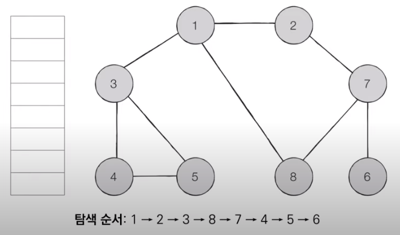

# 코딩 테스트 노트 with Python

## 5. 그래프 탐색 알고리즘: DFS / BFS

### 5.9 BFS(Breadth-First Search)
- BFS는 **너비 우선 탐색**이라고도 부르며, 그래프에서 **가까운 노드부터 우선적으로 탐색하는 알고리즘**입니다.
- BFS는 **큐 자료구조**를 이용하며, 구체적인 동작 과정은 다음과 같습니다.
  1. 탐색 시작 노드를 큐에 삽입하고 방문 처리를 합니다.
  2. 큐에서 노드를 꺼낸 뒤에 해당 노드의 인접 노드 중에서 방문하지 않은 노드를 모두 큐에 삽입하고 방문 처리합니다.
  3. 더 이상 2번의 과정을 수행할 수 없을 때까지 반복합니다.

- [Step 0] 그래프를 준비합니다. (방문 기준 : **번호가 낮은 인접 노드**부터)
  - 시작 노드 : 1

  </img> 

- [Step 1] 시작 노드인 '1'을 큐에 삽입하고 방문 처리를 합니다.

  </img> 

- [Step 2] 큐에서 노드 '1'을 꺼내 방문하지 않은 인접 노드 '2', '3', '8'을 큐에 삽입하고 방문 처리합니다.

    </img> 

- [Step 3] 큐에서 노드 '2'를 꺼내 방문하지 않은 인접 노드 '7'을 큐에 삽입하고 방문 처리합니다.

    </img> 

- [Step 4] 큐에서 노드 '3'을 꺼내 방문하지 않은 인접 노드 '4', '5'를 큐에 삽입하고 방문 처리합니다.

    </img> 

- [Step 5] 큐에서 노드 '8'을 꺼내고 방문하지 않은 인접 노드가 없으므로 무시합니다.

    </img> 

- 이러한 과정을 반복하여 **전체 노드의 탐색 순서(큐에 들어간 순서)** 는 다음과 같습니다.

    </img> 
<pre>
<code>
from collections import deque

# BFS 메서드 정의
def bfs(graph, start, visited):
    # 큐(Queue) 구현을 위해 deque 라이브러리 사용
    queue = deque([start])
    # 현재 노드를 방문 처리
    visited[start] = True
    # 큐가 빌 때까지 반복
    while queue:
        # 큐에서 하나의 원소를 뽑아 출력하기
        cur = queue.popleft()
        print(cur, end=' ')
        # 아직 방문하지 않은 인접한 원소들을 큐에 삽입
        for i in graph[cur]:
            if not visited[i]:
                queue.append(i)
                visited[i] = True

# 각 노드가 연결된 정보를 표현 (2차원 리스트: 인접리스트)
graph = [
    [], # 0번 노드 비우기
    [2, 3, 8],
    [1, 7],
    [1, 4, 5],
    [3, 5],
    [3, 4],
    [7],
    [2, 6, 8],
    [1, 7]
]

# 각 노드가 방문된 정보를 표현 (1차원 리스트)
visited = [False] * 9 # 0번 노드 안쓰지만 직관적으로 표현을 위해

# 정의된 BFS 함수 호출
bfs(graph, 1, visited)
</code>
</pre>
실행 결과
<pre>
<code>
1 2 3 8 7 4 5 6
</code>
</pre>