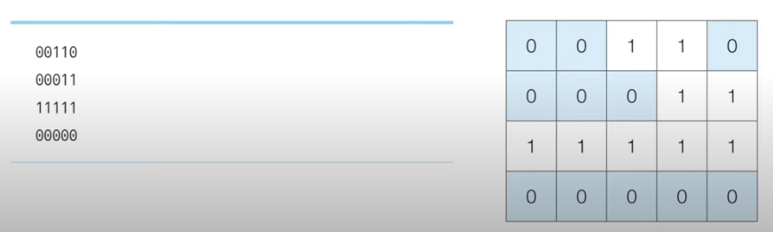

# 코딩 테스트 노트 with Python

## 5. 그래프 탐색 알고리즘: DFS / BFS

### 5.10 DFS/BFS 문제 : 음료수 얼려 먹기
#### [문제 설명]
- 

#### [문제 조건]
</img> 

#### [아이디어]
- 

#### [Code]
<pre>
<code>

</code>
</pre>

#### [분석]
- 

---