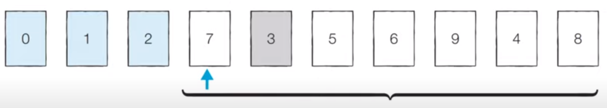

# 코딩 테스트 노트 with Python

## 6. 정렬 알고리즘

### 6.1 정렬 알고리즘
- **정렬(Sorting)** 이란 데이터를 특정한 기준에 따라 순서대로 나열하는 것을 말합니다.
- 일반적으로 문제 상황에 따라서 적절한 정렬 알고리즘이 공식처럼 사용됩니다.

  </img> 

### 6.2 선택 정렬
- 처리되지 않은 데이터 중에서 **가장 작은 데이터를 선택해 맨 앞에 있는 데이터와 바꾸는 것을 반복**합니다.

- 정렬할 데이터를 준비합니다.

 </img> 

- [Step 0] 처리되지 않은 데이터 중 가장 작은 '0'을 선택해 가장 앞의 '7'과 바꿉니다.

 </img> 

- [Step 1] 처리되지 않은 데이터 중 가장 작은 '1'을 선택해 가장 앞의 '5'와 바꿉니다.

 </img> 

- [Step 2] 처리되지 않은 데이터 중 가장 작은 '2'를 선택해 가장 앞의 '9'와 바꿉니다.

 </img> 

- [Step 3] 처리되지 않은 데이터 중 가장 작은 '3'을 선택해 가장 앞의 '7'과 바꿉니다.

 </img> 

- [Step 4] 이러한 과정을 반복하면 다음과 같이 정렬이 완료됩니다.

 </img> 
 
 #### [Code]
<pre>
<code>
array = [7, 5, 9, 0, 3, 1, 6, 2, 4, 8]

for i in range(len(array)):
    min_index = i # 가장 작은 원소의 인덱스
    for j in range(i + 1, len(array)):
        if array[min_index] > array[j]:
            min_index = j
    # Swap
    array[i], array[min_index] = array[min_index], array[i]

print(array)
</code>
</pre>
실행 결과
<pre>
<code>
[0, 1, 2, 3, 4, 5, 6, 7, 8, 9]
</code>
</pre>
[시간 복잡도]
- 선택 정렬은 N번 만큼 가장 작은 수를 찾아서 맨 앞으로 보내야 합니다.
- 구현 방식에 따라서 사소한 오차는 있을 수 있지만, 전체 연산 횟수는 다음과 같습니다.
  - N + (N - 1) + (N - 2) + ... + 2
- 이는 (N^2 + N - 2) / 2 로 표현 할 수 있는데, 빅오 표기법에 따라서 **O(N^2)** 이라고 작성합니다.

---

### 6.3 삽입 정렬
- 처리되지 않은 **데이터를 하나씩 골라 적절한 위치에 삽입**합니다.
- 선택 정렬에 비해 구현 난이도가 높은 편이지만, 일반적으로 더 효율적으로 동작합니다.

- [Step 0] 첫 번째 데이터 '7'은 그 자체로 정렬이 되어 있다고 판단하고, 두 번째 데이터인 '5'가 어떤 위치로 들어갈지 판단합니다. '7'의 왼쪽으로 들어가거나 오른쪽으로 들어가거나 두 경우만 존재합니다.

 </img> 

- [Step 1] 이어서 '9'가 어떤 위치로 들어갈지 판단합니다.

 </img> 

- [Step 2] 이어서 '0'이 어떤 위치로 들어갈지 판단합니다.

 </img> 

- [Step 3] 이어서 '3'이 어떤 위치로 들어갈지 판단합니다.

 </img> 

- [Step 4] 이러한 과정을 반복하면 다음과 같이 정렬이 완료됩니다.

 </img> 
 
 #### [Code]
<pre>
<code>
array = [7, 5, 9, 0, 3, 1, 6, 2, 4, 8]

for i in range(1, len(array)):
    for j in range(i, 0, -1): # 인덱스 i 부터 1까지 1씩 감소하며 반복하는 문법
        if array[j - 1] > array[j]: # 한 칸씩 왼쪽으로 이동
            array[j - 1], array[j] = array[j], array[j - 1]
        else: # 자기보다 작은 데이터를 만나면 그 위치에서 멈춤
            break
print(array)
</code>
</pre>
[시간 복잡도]
- 삽입 정렬의 시간 복잡도는 **O(N^2)** 이며, 선택 정렬과 마찬가지로 반복문이 두 번 중첩되어 사용됩니다.
- 삽입 정렬은 **현재 리스트의 데이터가 거의 정렬되어 있는 상태라면 매우 빠르게 동작**합니다.
  - 최선의 경우 **O(N)** 의 시간 복잡도를 가집니다.
  - 이미 정렬되어 있는 상태에서 다시 삽입 정렬을 수행하면 어떻게 될까요?

   </img> 