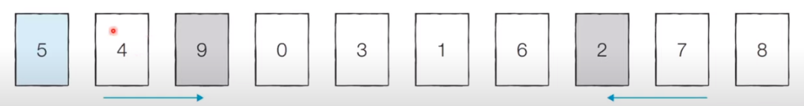
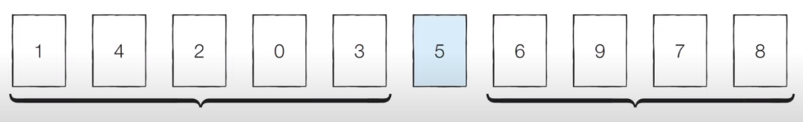

# 코딩 테스트 노트 with Python

## 6. 정렬 알고리즘

### 6.4 퀵 정렬
- 기준 데이터를 설정하고 그 **기준보다 큰 데이터와 작은 데이터의 위치를 바꾸는 방법**입니다.
- 일반적인 상황에서 가장 많이 사용되는 정렬 알고리즘 중 하나입니다.
- 병합 정렬과 더불어 대부분의 프로그래밍 언어의 정렬 라이브러리의 근간이 되는 알고리즘입니다.
- 가장 기본저인 퀵 정렬은 **첫 번째 데이터를 기준 데이터(Pivot)로 설정**합니다.

- [Step 0] 현재 피벗의 값은 '5'입니다. 왼쪽에서부터 '5'보다 큰 데이터를 선택하므로 '7'이 선택되고, 오른쪽에서부터 '5'보다 작은 데이터를 선택하므로 '4'가 선택됩니다. 이제 이 두 데이터의 위치를 서로 변경합니다.

    </img> 

- [Step 1] 현재 피벗의 값은 '5'입니다. 왼쪽에서부터 '5'보다 큰 데이터를 선택하므로 '9'가 선택되고, 오른쪽에서부터 '5'보다 작은 데이터를 선택하므로 '2'가 선택됩니다. 이제 이 두 데이터의 위치를 서로 변경합니다.

    </img> 

- [Step 2] 현재 피벗의 값은 '5'입니다. 왼쪽에서부터 '5'보다 큰 데이터를 선택하므로 '6'이 선택되고, 오른쪽에서부터 '5'보다 작은 데이터를 선택하므로 '1'이 선택됩니다. 단, 이처럼 **위치가 엇갈리는 경우 '피벗'과 '작은 데이터'의 위치를 서로 변경**합니다.

    </img> 

- [분할 완료] 이제 '5'의 왼쪽에 있는 데이터는 모두 5보다 작고, 오른쪽에 있는 데이터는 모두 '5'보다 크다는 특징이 있습니다. 이렇게 피벗을 기준으로 데이터 묶음을 나누는 작업을 **분할(Divide)** 이라고 합니다.

    </img> 

- [왼쪽 데이터 묶음 정렬] 왼쪽에 있는 데이터에 대해서 마찬가지로 정렬을 수행합니다.

    </img> 

- [오른쪽 데이터 묶음 정렬] 오른쪽에 있는 데이터에 대해서 마찬가지로 정렬을 수행합니다.
    - 이러한 과정을 반복하면 전체 데이터에 대해서 정렬이 수행됩니다.

    </img> 

[퀵 정렬이 빠른 이유]
- 이상적인 경우 분할이 절반씩 일어난다면 전체 연산 횟수로 O(NlogN)를 기대할 수 있습니다.
    - 너비 X 높이 = N X logN = NlogN

    </img> 

[퀵 정렬의 시간 복잡도]
- 퀵 정렬은 평균의 경우 O(NlogN)의 시간 복잡도를 가집니다.
- 하지만 최악의 경우 O(N^2)의 시간 복잡도를 가집니다.
    - 첫 번째 원소를 피벗으로 삼을 때, 이미 정렬된 배열에 대해서 퀵 정렬을 수행하면 어떻게 될까요?

    </img> 

 #### [Code]
<pre>
<code>
array = [5, 7, 9, 0, 3, 1, 6, 2, 4, 8]

def quick_sort(array, start, end):
    if start >= end:    # 원소가 1개인 경우 종료
        return
    pivot = start       # 피벗은 첫 번째 원소
    left = start + 1
    right = end

    while left <= right:
        # 피벗보다 큰 데이터를 찾을 때까지 반복
        while left <= end and array[left] <= array[pivot]:
            left += 1
        # 피벗보다 작은 데이터를 찾을 떄까지 반복
        while right > start and array[right] >= array[pivot]:
            right -= 1
        # 엇갈렸다면 작은 데이터와 피벗을 교체
        if left > right:
            array[right], array[pivot] = array[pivot], array[right]
        else: # 그렇지 않다면 작은 데이터와 큰 데이터를 교체
            array[left], array[right] = array[right], array[left]
    # 분할 이후 왼쪽 부분과 오른쪽 부분에서 각각 정렬 수행
    quick_sort(array, start, right - 1)
    quick_sort(array, right + 1, end)

quick_sort(array, 0, len(array) - 1)
print(array)
</code>
</pre>
- List Comprehension을 이용한 간결한 퀵 정렬
<pre>
<code>
array = [5, 7, 9, 0, 3, 1, 6, 2, 4, 8]

def quick_sort(array):
    # 리스트가 하나 이하의 원소만을 담고있다면 종료
    if len(array) <= 1:
        return array
    pivot = array[0] # 피벗은 첫 번째 원소
    tail = array[1:] # 피벗을 제외한 리스트

    left_side = [x for x in tail if x <= pivot] # 분할된 왼쪽 부분
    right_side = [x for x in tail if x > pivot] # 분할된 오른쪽 부분

    # 분할 이후 왼쪽 부분과 오른쪽 부분에서 각각 정렬 수행하고, 전체 리스트 반환
    return quick_sort(left_side) + [pivot] + quick_sort(right_side)

print(quick_sort(array))
</code>
</pre>
