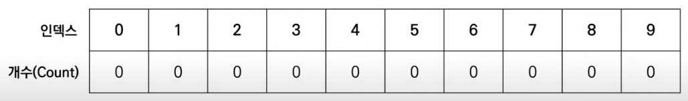
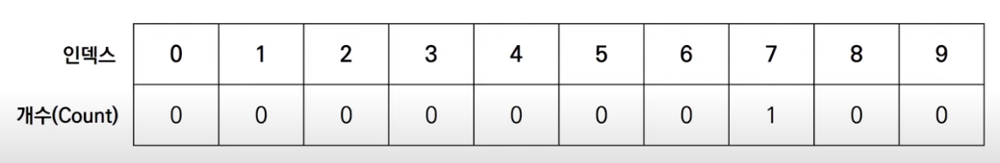
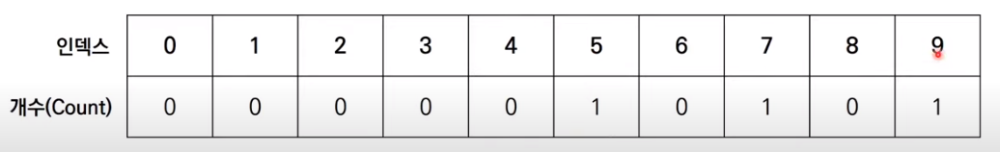
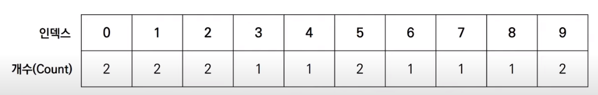
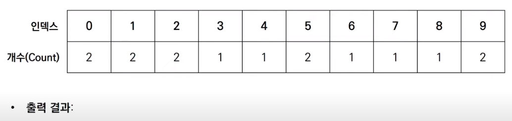
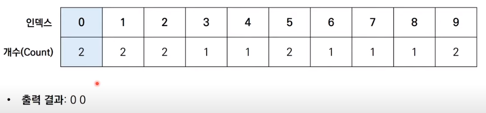
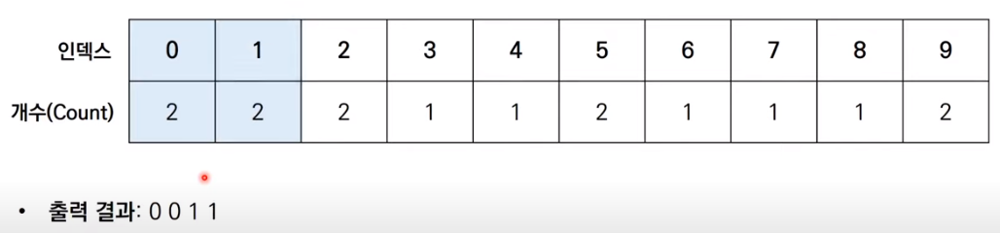
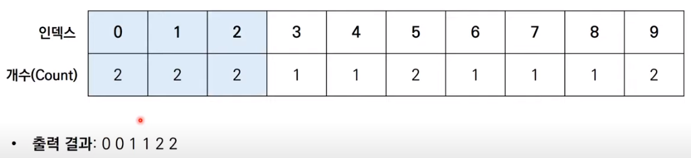
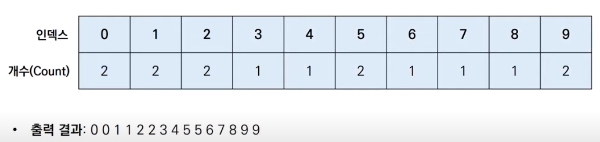

# 코딩 테스트 노트 with Python

## 6. 정렬 알고리즘

### 6.5 계수 정렬
- 특정한 조건이 부합할 때만 사용할 수 있지만 매우 빠르게 동작하는 정렬 알고리즘입니다.
    - 계수 정렬은 **데이터의 크기 범위가 제한되어 정수 형태로 표현 할 수 있을때** 사용 가능합니다.
- 데이터의 개수 N, 데이터(양수) 중 최댓값이 K일 때 최악의 경우에도 수행시간 **O(N + K)** 를 보장합니다.

- [Step 0] 가장 작은 데이터부터 가장 큰 데이터까지의 범위가 모두 담길 수 있도록 리스트를 생성합니다.
    - 정렬할 데이터: 7 5 9 0 3 1 6 2 9 1 4 8 0 5 2

    </img> 

- [Step 1] 데이터를 하나씩 확인하며 데이터의 값과 동일한 인덱스의 데이터를 1씩 증가시킵니다.
    - 정렬할 데이터: **7** 5 9 0 3 1 6 2 9 1 4 8 0 5 2

    </img> 

- [Step 2] 데이터를 하나씩 확인하며 데이터의 값과 동일한 인덱스의 데이터를 1씩 증가시킵니다.
    - 정렬할 데이터: **7** **5** 9 0 3 1 6 2 9 1 4 8 0 5 2

    </img> 

- [Step 3] 데이터를 하나씩 확인하며 데이터의 값과 동일한 인덱스의 데이터를 1씩 증가시킵니다.
    - 정렬할 데이터: **7** **5** **9** 0 3 1 6 2 9 1 4 8 0 5 2

    </img> 

- [Step 15] 결과적으로 최종 리스트에는 각 데이터가 몇 번씩 등장했는지 그 횟수가 기록됩니다.
    - 정렬할 데이터: **7** **5** **9** **0** **3** **1** **6** **2** **9** **1** **4** **8** **0** **5** **2**

    </img> 
- 결과를 확인할 때는 리스트의 첫 번째 데이터부터 하나씩 그 값만큼 반복하여 인덱스를 출력합니다.

    </img> 
    </img> 
    </img> 
    </img> 
    </img> 

 #### [Code]
<pre>
<code>
# 모든 원소의 값이 0보다 크거나 같다고 가정
array = [7, 5, 9, 0, 3, 1, 6, 2, 9, 1, 4, 8, 0, 5, 2]
# 모든 범위를 포함하는 리스트 선언(모든 값은 0으로 초기화)
count = [0] * (max(array) + 1)

for i in range(len(array)):
    count[array[i]] += 1    # 각 데이터에 해당하는 인덱스의 값 증가

for i in range(len(count)): # 리스트에 기록된 정렬 정보 확인
    for j in range(count[i]):
        print(i, end=' ')   # 띄어쓰기를 구분으로 등장한 횟수만큼 인덱스 출력
</code>
</pre>
실행 결과
<pre>
<code>
0 0 1 1 2 2 3 4 5 5 6 7 8 9 9
</code>
</pre>

[계수 정렬의 복잡도 분석]
- 계수 정렬의 시간 복잡도와 공간 복잡도는 모두 O(N + K)입니다.
- 계수 정렬은 때에 따라서 심각한 비효율성을 초래할 수 있습니다.
    - 데이터가 0과 999,999로 단 2개만 존재하는 경우를 생각해 봅시다.
- 계수 정렬은 **동일한 값을 가지는 데이터가 여러개 등장**할 때 효과적으로 사용할 수 있습니다.
    - 성적의 경우 100점을 맞은 학생이 여러 명일 수 있기 때문에 계수 정렬이 효과적입니다.