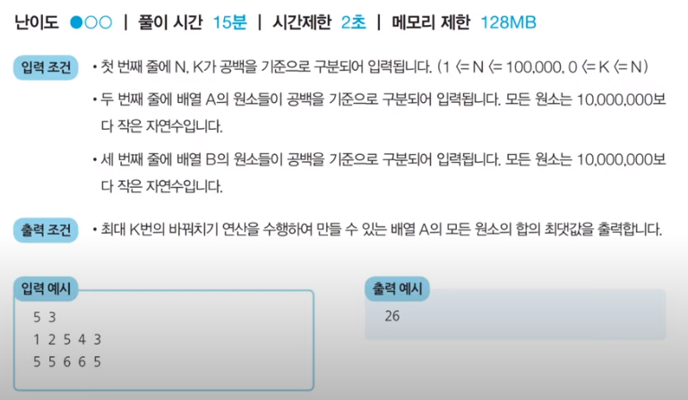

# 코딩 테스트 노트 with Python

## 6. 정렬 알고리즘

### 6.7 정렬 문제 : 두 배열의 원소 교체
#### [문제 설명]
- 승훈이는 두 개의 배열 A와 B를 가지고 있습니다. 두 배열은 N개의 원소로 구성되어 있으며, 배열의 원소는 모두 자연수입니다.
- 승훈이는 **최대 K번의 바꿔치기** 연산을 수행할 수 있는데, 바꿔치기 연산이란 배열 A에 있는 원소 하나와 배열B에 있는 원소 하나를 골라서 두 원소를 서로 바꾸는 것을 말합니다.
- 승훈이의 최종 목표는 배열 A의 모든 원소의 합이 최대가 되도록 하는 것이며, 여러분은 승훈이를 도와야합니다.
- N, K, 그리고 배열 A와 B의 정보가 주어졌을 때, 최대 K번의 바꿔치기 연산을 수행하며 만들 수 있는 **배열 A의 모든 원소의 합의 최댓값을 출력**하는 프로그램을 작성하세요.

#### [문제 예제]
- 예를 들어 N = 5, K = 3이고, 배열 A와 B가 다음과 같다고 해봅시다.
    - 배열 A = [1, 2, 5, 4, 3]
    - 배열 B = [5, 5, 6, 6, 5]
- 이 경우, 다음과 같이 세 번의 연산을 수행할 수 있습니다.
    - 연산 1) 배열 A의 원소 '1'과 배열 B의 원소 '6'을 바꾸기
    - 연산 2) 배열 A의 원소 '2'과 배열 B의 원소 '6'을 바꾸기
    - 연산 2) 배열 A의 원소 '3'과 배열 B의 원소 '5'을 바꾸기
- 세 번의 연산 이후 배열A와 배열B의 상태는 다음과 같이 구성될 것입니다.
    - 배열 A = [6, 6, 5, 4, 5]
    - 배열 B = [3, 5, 1, 2, 5]
- 이때 배열 A의 모든 원소의 합은 26이 되며, 이보다 더 합을 크게 만들 수는 없습니다.

#### [문제 조건]
</img> 

#### [아이디어]
- 핵심 아이디어 : 매번 배열 A에서 가장 작은 원소를 골라서, 배열 B에서 가장 큰 원소와 교체합니다.
- 가장 먼저 배열 A와 B가 주어지면 A에 대하여 오름차순 정렬하고, B에 대하여 내림차순 정렬합니다.
- 이후에 두 배열의 원소를 첫 번째 인덱스부터 차례로 확인하면서 A의 원소가 B의 원소보다 작을 때에만 교체를 수행합니다.
- 이 문제에서는 두 배열의 원소가 최대 100,000개까지 입력될 수 있으므로, 최악의 경우 O(NlogN)을 보장하는 정렬 알고리즘을 이용해야 합니다.

#### [Code]
<pre>
<code>
# N과 K를 입력 받기
n, k = map(int, input().split())
# 배열 A의 모든 원소를 입력 받기
a = list(map(int, input().split()))
# 배열 B의 모든 원소를 입력 받기
b = list(map(int, input().split()))

# 배열 A는 오름차순 정렬 수행
a.sort()
# 배열 B는 내림차순 정렬 수행
b.sort(reverse = True)

# 첫 번째 인덱스부터 확인하며, 두 배열의 원소를 최대 K번 비교
for i in range(k):
    # A의 원소가 B의 원소보다 작은 경우
    if a[i] < b[i]:
        # 두 원소를 교체
        a[i], b[i] = b[i], a[i]
    # A의 원소가 B의 원소보다 크거나 같을 때, 반복문을 탈출
    else:
        break
# 배열 A의 모든 원소의 합 출력
print(sum(a))
</code>
</pre>
실행 결과
<pre>
<code>
-입력-
5 3
1 2 5 4 3
5 5 6 6 5

-출력-
26
</code>
</pre>