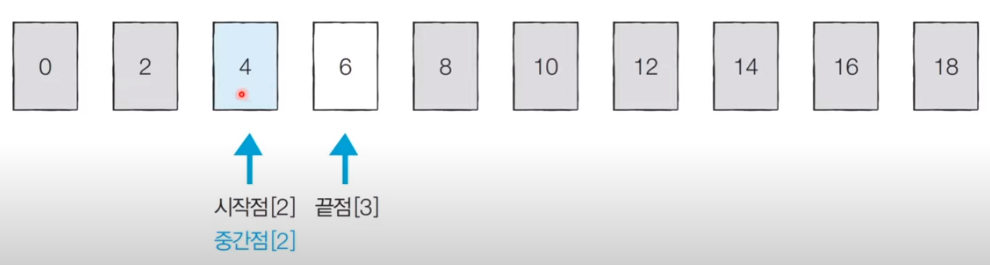

# 코딩 테스트 노트 with Python

## 7. 이진 탐색 알고리즘

### 7.1 이진 탐색 알고리즘
- 순차 탐색 : 리스트 안에 있는 특정한 **데이터를 찾기 위해 앞에서부터 데이터를 하나씩 확인**하는 방법
- 이진 탐색 : 정렬되어 있는 리스트에서 **탐색 범위를 절반씩 좁혀가며 데이터를 탐색**하는 방법
  -  이진 탐색은 시작점, 끝점, 중간점을 이용하여 탐색 범위를 설정합니다.

#### [이진 탐색 동작 예시]
- 이미 정렬된 10개의 데이터 중에서 값이 4인 원소를 찾는 예시를 살펴봅시다.

  </img> 

- [Step1] 시작점 : 0, 끝점 : 9, 중간점 : 4 (소수점 이하 제거)

  </img> 

- [Step2] 시작점 : 0, 끝점 : 3, 중간점 : 1 (소수점 이하 제거)

  </img> 

- [Step3] 시작점 : 2, 끝점 : 3, 중간점 : 2 (소수점 이하 제거)

  </img> 

#### [이진 탐색 시간 복잡도]
- 단계마다 탐색 범위를 2로 나누는 것과 동일하므로 연산 횟수는 logN에 비례합니다.
- 예를 들어 초기 데이터 개수가 32개일 때, 이상적으로 1단계를 거치면 16개가량의 데이터만 남습니다.
  - 2단계를 거치면 8개가량의 데이터만 남습니다.
  - 3단계를 거치면 4개가량의 데이터만 남습니다.
- 다시 말해 이진 탐색은 탐색 범위를 절반씩 줄이며, **시간 복잡도는 O(logN)** 을 보장합니다.

#### [Code 재귀함수]
<pre>
<code>
# 이진 탐색 소스코드 구현(재귀함수)
def binary_search(array, target, start, end):
    if start > end:
        return None
    mid = (start + end) // 2
    # 찾은 경우 중간점 인덱스 반환
    if target == array[mid]:
        return mid
    # 중간점의 값보다 찾고자 하는 값이 작은 경우 왼쪽 확인
    elif target < array[mid]:
        return binary_search(array, target, start, mid - 1)
    # 중간점의 값보다 찾고자 하는 값이 큰 경우 오른쪽 확인
    else:
        return binary_search(array, target, mid + 1, end)

# n(원소의 개수)과 target(찾고자 하는 값)을 입력 받기
n, target = list(map(int, input().split()))
# 전체 원소 입력 받기
array = list(map(int, input().split()))

# 이진 탐색 수행 결과 출력
result = binary_search(array, target, 0, n - 1)
if result == None:
    print("원소가 존재하지 않습니다.")
else:
    print(result + 1)
</code>
</pre>
#### [Code 반복문]
<pre>
<code>
# 이진 탐색 소스코드 구현(반복문)
def binary_search(array, target, start, end):
    while start <= end:
        mid = (start + end) // 2
        # 찾은 경우 중간점 인덱스 반환
        if target == array[mid]:
            return mid
        # 중간점의 값보다 찾고자 하는 값이 작은 경우 왼쪽 확인
        elif target < array[mid]:
            end = mid - 1
        # 중간점의 값보다 찾고자 하는 값이 큰 경우 오른쪽 확인
        else:
            start = mid + 1
    return None

# n(원소의 개수)과 target(찾고자 하는 값)을 입력 받기
n, target = list(map(int, input().split()))
# 전체 원소 입력 받기
array = list(map(int, input().split()))

# 이진 탐색 수행 결과 출력
result = binary_search(array, target, 0, n - 1)
if result == None:
    print("원소가 존재하지 않습니다.")
else:
    print(result + 1)
</code>
</pre>
실행 결과 1
<pre>
<code>
10 7
1 3 5 7 9 11 13 15 17 19
4
</code>
</pre>
실행 결과 2
<pre>
<code>
10 7
1 3 5 6 9 11 13 15 17 19
원소가 존재하지 않습니다.
</code>
</pre>

### 7.2 파이썬 이진 탐색 라이브러리
- bisect_left(a, x) : 정렬된 순서를 유지하면서 배열 a에 x를 삽입할 가장 왼쪽 인덱스를 반환
- bisect_right(a, x) : 정렬된 순서를 유지하면서 배열 a에 x를 삽입할 가장 오른쪽 인덱스를 반환

  </img> 

#### <Code 1>
<pre>
<code>
from bisect import bisect_left, bisect_right

a = [1, 2, 4, 4, 8]
x = 4

print(bisect_left(a, x))
print(bisect_right(a, x))
</code>
</pre>
실행 결과
<pre>
<code>
2
4
</code>
</pre>

#### <Code 2>
<pre>
<code>
from bisect import bisect_left, bisect_right

# 값이 [left_value, right_value]인 데이터의 개수를 반환하는 함수
def count_by_range(a, left_value, right_value):
    right_index = bisect_right(a, right_value)
    left_index = bisect_left(a, left_value)
    return right_index - left_index

# 배열 선언
a = [1, 2, 3, 3, 3, 3, 4, 4, 8, 9]

# 값이 4인 데이터 개수 출력
print(count_by_range(a, 4, 4))

# 값이 [-1, 3] 범위에 있는 데이터 개수 출력
print(count_by_range(a, -1, 3))
</code>
</pre>
실행 결과
<pre>
<code>
2
6
</code>
</pre>

