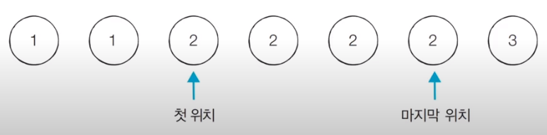

# 코딩 테스트 노트 with Python

## 7. 이진 탐색 알고리즘

### 7.4 파라메트릭 서치 (Parametric Search)
- 파라메트릭 서치란 **최적화 문제를 결정 문제('예' 혹은 '아니오')로 바꾸어 해결하는 기법**입니다.
  - 예시 : 특정한 조건을 만족하는 가장 알맞은 값을 빠르게 찾는 최적화 문제
- 일반적으로 코딩 테스트에서 파라메트릭 서치 문제는 **이진 탐색을 이용하여 해결**할 수 있습니다.

### 7.5 이진 탐색 문제1 : 떡볶이 떡 만들기
#### [문제 설명]
- 오늘 승훈이는 여행 가신 부모님을 대신해서 떡집 일을 하기로 했습니다. 오늘은 떡볶이 떡을 만드는 날입니다. 동빈이네 떡볶이 떡은 재밌게도 떡의 길이가 일정하지 않습니다. 대신에 한 봉지 안에 들어가는 떡의 총 길이는 절단기로 잘라서 맞춰줍니다.
- 절단기에 높이(H)를 지정하면 줄지어진 떡을 한 번에 절단합니다. 높이가 H보다 긴 떡은 H위의 부분이 잘릴 것이고, 낮은 떡은 잘리지 않습니다.
- 예를 들어 높이가 19, 14, 10, 17cm인 떡이 나란히 있고 절단가 높이를 15cm로 지정하면 자른 뒤 떡의 높이는 15, 14, 10, 15cm가 될 것입니다. 잘린 떡의 길이는 차례대로 4, 0, 0, 2cm입니다. 손님은 6cm만큼의 길이를 가져갑니다.
- 손님이 왔을 때 요청한 총 길이가 M일 때 **적어도 M만큼의 떡을 얻기 위해 절단기에 설정할 수 있는 높이의 최댓값을 구하는 프로그램**을 작성하세요.

#### [문제 조건]
</img> 

#### [아이디어]
- 적절한 높이를 찾을 때까지 이진 탐색을 수행하여 높이 H를 반복해서 조정하면 됩니다.
- '현재 이 높이로 자르면 조건을 만족할 수 있는가?'를 확인한 뒤에 **조건의 만족 여부('예' 혹은 '아니오')에 따라서 탐색 범위를 좁혀서 해결**할 수 있습니다.
- 절단기의 높이는 0부터 10억까지의 정수 중 하나입니다.
  - 이렇게 큰 탐색 범위를 보면 가장 먼저 **이진 탐색**을 떠올려야 합니다.
- 문제에서 제시된 예시를 통해 그림으로 이해해 봅시다.

- [Step 1] 시작점 : 0, 끝점 : 19, 중간점 : 9 이때 필요한 떡의 크기 : M = 6이므로, 결과 저장

</img> 

- [Step 2] 시작점 : 10, 끝점 : 19, 중간점 : 14 이때 필요한 떡의 크기 : M = 6이므로, 결과 저장

</img> 

- [Step 3] 시작점 : 15, 끝점 : 19, 중간점 : 17 이때 필요한 떡의 크기 : M = 6이므로, 결과 저장하지 않음

</img> 

- [Step 4] 시작점 : 15, 끝점 : 16, 중간점 : 15 이때 필요한 떡의 크기 : M = 6이므로, 결과 저장

</img> 

- 이러한 이진 탐색 과정을 반복하면 답을 도출할 수 있습니다.
- 중간점의 값은 **시간이 지날수록 '최적화된 값'** 이 되기 때문에, 과정을 반복하면서 얻을 수 있는 떡의 길이 합이 필요한 떡의 길이보다 크거나 같을 때마다 중간점의 값을 기록하면 됩니다.

#### [Code]
<pre>
<code>
# 떡의 개수(N)와 요청한 떡의 길이(M)을 입력
n, m = list(map(int, input().split(' ')))
# 각 떡의 개별 높이 정보를 입력
array = list(map(int, input().split()))

# 이진 탐색을 위한 시작점과 끝점 설정
start = 0
end = max(array)

# 이진 탐색 수행(반복문)
result = 0
while start <= end:
    total = 0
    mid = (start + end) // 2
    for x in array:
        # 잘랐을 때의 떡의 양 계산
        if x > mid:
            total += x - mid
    # 떡의 양이 부족한 경우 더 많이 자르기 (왼쪽 부분 탐색)
    if total < m:
        end = mid - 1
    # 떡의 양이 충분한 경우 덜 자르기 (오른쪽 부분 탐색)
    else:
        result = mid # 최대한 덜 잘랐을 때가 정답이므로, 여기에서 result에 기록
        start = mid + 1
# 정답 출력
print(result)
</code>
</pre>

### 7.6 이진 탐색 문제2 : 정렬된 배열에서 특정 수의 개수 구하기
#### [문제 설명]
- N개의 원소를 포함하고 있는 수열이 오름차순으로 정렬되어 있습니다. 이때 이 **수열에서 x가 등장하는 횟수를 계산**하세요. 예를 들어 수열 {1, 1, 2, 2, 2, 2, 3}이 있을때 x = 2라면, 현재 수열에서 값이 2인 원소가 4개이므로 4를 출력합니다.
- 단, 이 문제는 시간 복잡도 O(logN)으로 알고리즘을 설계하지 않으면 시간 초과 판정을 받습니다.

#### [문제 조건]
</img> 

#### [아이디어]
- 시간 복잡도 O(logN)으로 동작하는 알고리즘을 요구하고 있습니다.
  - 일반적인 **선형 탐색(Linear Search)로는 시간 초과 판정** 을 받습니다.
  - 하지만 데이터가 정렬되어 있기 때문에 **이진 탐색을 수행** 할 수 있습니다.
- 특정 값이 등장하는 첫 번째 위치와 마지막 위치를 찾아 위치 차이를 계산해 문제를 해결할 수 있습니다.

  </img> 

#### [Code]
<pre>
<code>
from bisect import bisect_left, bisect_right

# 값이 [left_value, right_value]인 데이터의 개수를 반환하는 함수
def count_by_range(array, left_value, right_value):
    right_index = bisect_right(array, right_value)
    left_index = bisect_left(array, left_value)
    return right_index - left_index

# 데이터의 개수 N, 찾고자 하는 값 x 입력받기
n, x = list(map(int, input().split(' ')))
# 전체 데이터 입력받기
array = list(map(int, input().split()))

# 값이 [x, x] 범위에 있는 데이터의 개수 계산
count = count_by_range(array, x, x)

# 값이 x인 원소가 존재하지 않는다면
if count == 0:
    print(-1)
# 값이 x인 원소가 존재한다면
else:
    print(count)
</code>
</pre>