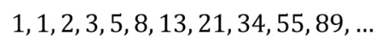

# 코딩 테스트 노트 with Python

## 8. 다이나믹 프로그래밍

### 8.1 다이나믹 프로그래밍
- 다이나믹 프로그래밍은 **메모리를 적절히 사용하여 수행시간 효율성을 비약적으로 향상시키는 방법**입니다.
- **이미 계산된 결과(작은 문제)는 별도의 메모리 영역에 저장**하여 다시 계산하지 않도록 합니다.
- 다이나믹 프로그래밍의 구현은 일반적으로 두 가지 방식(탑다운과 보텀업)으로 구성됩니다.
- 다이나믹 프로그래밍은 **동적 계획법**이라고도 부릅니다.
- 일반적인 프로그래밍 분야에서의 동적(Dynamic)이란 어떤 의미를 가질까요?
  - 자료구조에서 동적 할당(Dynamic Allocation)은 **'프로그램이 실행되는 도중에 실행에 필요한 메모리를 할당하는 기법'** 을 의미합니다.
  - 반면에 다이나믹 프로그래밍에서 '다이나믹'은 별다른 의미 없이 사용된 단어입니다.

#### [다이나믹 프로그래밍의 조건]
- 다이나믹 프로그래밍은 문제가 다음의 조건을 만족할 때 사용할 수 있습니다.
1. 최적 부분 구조(Optimal Substructure)
      - 큰 문제를 작은 문제로 나눌 수 있으며 작은 문제의 답을 모아서 큰 문제를 해결할 수 있습니다.
  2. 중복되는 부분 문제(Overlapping Subproblem)
      - 동일한 작은 문제를 반복적으로 해결해야 합니다.

---

### 8.2 피보나치 수열
- 피보나치 수열은 다음과 같은 형태의 수열이며, 다이나믹 프로그래밍으로 효과적으로 계산할 수 있습니다.

  </img> 

- 점화식이란 인접한 항들 사이의 관계식을 의미합니다.
- 피보나치 수열을 점화식으로 표현하면 다음과 같습니다.

  </img> 

- 피보나치 수열이 계산되는 과정은 다음과 같이 표현할 수 있습니다.
  - 프로그래밍에서는 이러한 수열을 배열이나 리스트를 이용해 표현합니다.

    </img> 

  - n번째 피보나치 수를 f(n)이라고 할 떄 4번째 피보나치 수 f(4)를 구하는 과정은 다음과 같습니다.

    </img> 
  
#### [Code]
<pre>
<code>
# 피보나치 함수(Fibonacci Function)을 재귀함수로 구현
def fibo(x):
    if x == 1 or x == 2:
        return 1
    return fibo(x - 1) + fibo(x - 2)

print(fibo(4))
</code>
</pre>
실행 결과
<pre>
<code>
3
</code>
</pre>

#### [피보나치 수열의 시간 복잡도 분석]
- 단순 재귀함수로 피보나치 수열을 해결하면 지수 시간 복잡도를 가지게 됩니다.
- 다음과 같이 f(2)가 여러 번 호출되는 것을 확인할 수 있습니다.(중복되는 부분 문제)

</img> 

- 피보나치 수열의 시간 복잡도는 다음과 같습니다.
  - 세타 표기법 : θ(1.618...^N)
  - 빅오 표기법 : O(2^N)
- 빅오 표기법을 기준으로 f(30)을 계산하기 위해 약 10억가량의 연산을 수행해야 합니다.
- 그렇다면 f(100)을 계산하기 위해 얼마나 많은 연산을 수행해야 할까요?

---

### 8.3 피보나치 수열의 효율적인 해법 : 다이나믹 프로그래밍
- 다이나믹 프로그래밍의 사용 조건을 만족하는지 확인합니다.
  1. 최적 부분 구조 : 큰 문제를 작은 문제로 나눌 수 있습니다.
  2. 중복되는 부분 문제 : 동일한 작은 문제를 반복적으로 해결합니다.
- 피보나치 수열은 다이나믹 프로그래밍의 사용 조건을 만족합니다.

#### 메모이제이션(Memoization)
- 메모이제이션은 다이나믹 프로그래밍을 구현하는 방법 중 하나입니다.
- **한 번 계산한 결과를 메모리 공간에 메모**하는 기법입니다.
  - 같은 문제를 다시 호출하면 메모했던 결과를 그대로 가져옵니다.
  - 값을 기록해 놓는다는 점에서 **캐싱(Caching)** 이라고도 합니다.

#### 탑다운 vs 보텀업
- 탑다운(메모이제이션) 방식은 **하향식**이라고도 하며 보텀업 방식은 **상향식**이라고도 합니다.
- 다이나믹 프로그래밍의 전형적인 형태는 보텀업 방식입니다.
  - 결과 저장용 리스트는 **DP 테이블**이라고 부릅니다.
- 엄밀히 말하면 메모이제이션은 이전에 계산된 결과를 일시적으로 기록해 놓는 넓은 개념을 의미합니다.
  - 따라서 메모이제이션은 다이나믹 프로그래밍에 국한된 개념은 아닙니다.
  - 한 번 계산된 결과를 담아 놓기만 하고 다이나믹 프로그래밍을 위해 활용하지 않을 수도 있습니다.

#### [Code 탑다운 DP 피보나치]
<pre>
<code>
# 한 번 계산된 결과를 메모이제이션(Memoization)하기 위한 리스트 초기화
d = [0] * 100

# 피보나치 함수(Fibonacci Function)를 재귀함수로 구현(탑다운 다이나믹 프로그래밍)
def fibo(x):
    # 종료 조건(1 혹은 2일 때 1을 반환)
    if x == 1 or x == 2:
        return 1
    # 이미 계산한 적 있는 문제라면 그대로 반환
    if d[x] != 0:
        return d[x]
    # 아직 계산하지 않은 문제라면 점화식에 따라서 피보나치 결과 반환
    d[x] = fibo(x - 1) + fibo(x - 2)
    return d[x]

print(fibo(99))
</code>
</pre>
실행 결과
<pre>
<code>
218922995834555169026
</code>
</pre>

#### [Code 보텀업 DP 피보나치]
<pre>
<code>
# 앞서 계산된 결과를 저장하기 위한 DP 테이블 초기화
d = [0] * 100

# 첫 번째 피보나치 수와 두 번째 피보나치 수는 1
d[1] = 1
d[2] = 1
n = 99

# 피보나치 함수(Fibonacci Function) 반복문으로 구현(보텀업 다이나믹 프로그래밍)
for i in range(3, n + 1):
    d[i] = d[i - 1] + d[i - 2]

print(d[n])
</code>
</pre>
실행 결과
<pre>
<code>
218922995834555169026
</code>
</pre>

#### [피보나치 수열 : 메모이제이션 동작 분석]
- 이미 계산된 결과를 메모리에 저장하면 다음과 같이 색칠된 노드만 처리할 것을 기대할 수 있습니다.

</img> 

- 실제로 호출되는 함수에 대해서만 확인해보면 다음과 같이 방문합니다.

</img> 

- 메모이제이션을 이용하는 경우 피보나치 수열 함수의 **시간 복잡도는 O(N)** 입니다.
<pre>
<code>
d = [0] * 100

def fibo(x):
    print('f(' + str(x) + ')', end=' ')
    if x == 1 or x == 2:
        return 1
    if d[x] != 0:
        return d[x]
    d[x] = fibo(x - 1) + fibo(x - 2)
    return d[x]

fibo(6)
</code>
</pre>
실행 결과
<pre>
<code>
f(6) f(5) f(4) f(3) f(2) f(1) f(2) f(3) f(4)
</code>
</pre>

### 8.4 다이나믹 프로그래밍 vs 분할 정복
- 