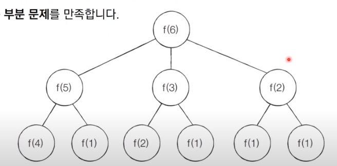

# 코딩 테스트 노트 with Python

## 8. 다이나믹 프로그래밍

### 8.6 DP 문제1 : 개미 전사
#### [문제 설명]
- 개미 전사는 부족한 식량을 충당하고자 메뚜기 마을의 식량창고를 몰래 공격하려고 합니다. 메뚜기 마을에는 여러 개의 식량창고가 있는데 식량창고는 일직선으로 이어져 있습니다.
- 각 식량창고에는 정해진 수의 식량을 저장하고 있으며 개미 전사는 식량창고를 선택적으로 약탈하여 식량을 빼앗을 예정입니다. 이때 메뚜기 정찰병들은 일직선상에 존재하는 식량창고 중에서 서로 인접한 식량창고가 공격받으면 바로 알아챌 수 있습니다.
- 따라서 개미 전사가 정찰병에게 들키지 않고 식량창고를 약탈하기 위해서는 *최소한 한 칸 이상 떨어진 식량창고를 약탈*해야 합니다.

    </img> 

- 예를 들어 식량창고 4개가 다음과 같이 존재한다고 가정합시다.

    </img> 

- 이때 개미 전사는 두 번째 식량창고와 네 번째 식량창고를 선택했을 때 최댓값인 총 8개의 식량을 빼앗을 수 있습니다. 개미 전사는 식량창고가 이렇게 일직선상일 때 최대한 많은 식량을 얻기를 원합니다.
- 개미 전사를 위해 식량창고 N개에 대한 정보가 주어졌을 때 **얻을 수 있는 식량의 최댓값**을 구하는 프로그램을 작성하세요.

#### [문제 조건]
</img> 

#### [아이디어]
- 예시를 확인해 봅시다. N = 4일 때, 다음과 같은 경우들이 존재할 수 있습니다.
    - 식량을 선택할 수 있는 경우의 수는 다음과 같이 8가지 입니다.
    - 7번째 경우에서 8만큼의 식량을 얻을 수 있으므로 최적의 해는 8입니다.

    </img> 

- ai = i번째 식량창고까지의 최적의 해(얻을 수 있는 식량의 최댓값)
    - 이렇게 정의한다면 다이나믹 프로그래밍을 적용할 수 있습니다.

        </img> 

- 왼쪽부터 차례대로 식량창고를 턴다고 했을 때, 특정한 i번째 식량창고에 대해서 털지 안 털지의 여부를 경정하면, 아래 2가지 경우 중에서 더 많은 식량을 털 수 있는 경우를 선택하면 됩니다.

    </img> 

- ai = i번째 식량창고까지의 최적의 해 (얻을 수 있는 식량의 최댓값)
- ki = i번째 식량창고에 있는 식량의 양
- 점화식은 다음과 같습니다.

    </img> 

- 한 칸 이상 떨어진 식량창고는 항상 털 수 있으므로 (i - 3)번째 이하는 고려할 필요가 없습니다.

#### [Code]
<pre>
<code>
# 정수 N을 입력 받기
n = int(input())
# 모든 식량 정보 입력 받기
array = list(map(int, input().split()))

# 앞서 계산된 결과를 저장하기 위한 DP 테이블 초기화
d = [0] * 100

# 다이나믹 프로그래밍(Dynamic Programming) 진행(Bottom Up)

d[0] = array[0]
d[1] = max(array[0], array[1])
for i in range(2, n):
    d[i] = max(d[i - 1], d[i - 2] + array[i])

# 계산된 결과 출력 
print(d[n - 1])
</code>
</pre>

### 8.7 DP 문제2 : 1로 만들기
#### [문제 설명]
- 정수 X가 주어졌을 때, 정수 X에 사용할 수 있는 연산은 다음과 같이 4가지 입니다.
    1. X가 5로 나누어 떨어지면, 5로 나눕니다.
    2. X가 3으로 나누어 떨어지면, 3으로 나눕니다.
    3. X가 2로 나누어 떨어지면, 2로 나눕니다.
    4. X에서 1을 뺍니다.
- 정수 X가 주어졌을 때, 연산 4개를 적절히 사용해서 값을 1로 만들고자 합니다. 연산을 사용하는 횟수의 최솟값을 출력하세요. 예를 들어 정수가 26이면 다음과 같이 계산해서 3번의 연산이 최솟값입니다.
    - 26 -> 25 -> 5 -> 1

#### [문제 조건]
</img> 

#### [아이디어]
- 피보나치 수열 문제를 도식화한 것처럼 함수가 호출되는 과정을 그림으로 그려보면 다음과 같습니다.
    - **최적 부분 구조**와 **부분 문제**를 만족합니다.

    </img> 

- ai = i를 1로 만들기 위한 최소 연산 횟수
- 점화식은 다음과 같습니다.

    </img> 

- 단, 1을 빼는 연산을 제외하고는 *해당 수로 나누어떨어질 때에 한해 점화식을 적용*할 수 있습니다.

#### [Code]
<pre>
<code>
# 정수 N을 입력 받기
n = int(input())

# 앞서 계산된 결과를 저장하기 위한 DP 테이블 초기화
d = [0] * 30001

# 다이나믹 프로그래밍(Dynamic Programming) 진행(Bottom Up)
for i in range(2, n + 1):
    # 현재의 수에서 1을 빼는 경우
    d[i] = d[i-1] + 1
    # 현재의 수가 5로 나누어 떨어지는 경우
    if i % 5 == 0:
        d[i] = min(d[i], d[i//5] + 1)
    # 현재의 수가 3으로 나누어 떨어지는 경우
    if i % 3 == 0:
        d[i] = min(d[i], d[i//3] + 1)
    # 현재의 수가 2로 나누어 떨어지는 경우
    if i % 2 == 0:
        d[i]= min(d[i], d[i//2] + 1)
# 계산된 결과 출력
print(d[n])
</code>
</pre>