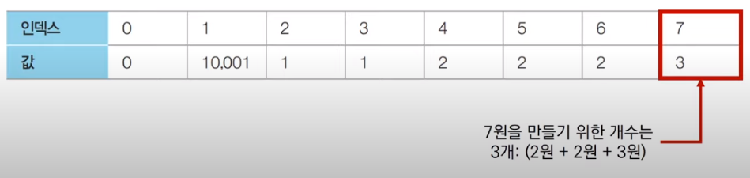

# 코딩 테스트 노트 with Python

## 8. 다이나믹 프로그래밍

### 8.8 DP 문제3 : 효율적인 화폐 구성
#### [문제 설명]
- N가지 종류의 화폐가 있습니다. 이 화폐들의 개수를 최소한으로 이용해서 그 가치의 합이 M원이 되도록 하려고 합니다. 이때 각 종류의 화폐는 몇개라도 사용할 수 있습니다.
- 예를 들어 2원, 3원 단위의 화폐가 있을 때는 15원을 만들기 위해 3원을 5개 사용하는 것이 가장 최소한의 화폐 개수입니다.
- *M원을 만들기 위한 최소한의 화폐 개수*를 출력하는 프로그램을 작성하세요.

#### [문제 조건]
</img> 

#### [아이디어]
- ai = 금액 i를 만들 수 있는 최소한의 화폐 개수
- k = 각 화폐의 단위
- 점화식 : 각 화폐 단위인 k를 하나씩 확인하며
    - ai-k를 만드는 방법이 존재하는 경우, ai = min(ai, ai-k + 1)
    - ai-k를 만드는 방법이 존재하지 않는 경우, ai = INF

- N = 3, M = 7이고, 각 화폐의 단위가 2, 3, 5인 경우 확인해 봅시다.
- [Step 0] 초기화
    - 먼저 각 인덱스에 해당하는 값으로 INF(무한)의 값을 설정합니다.
    - INF은 특정 금액을 만들 수 있는 화폐 구성이 가능하지 않다는 의미를 가집니다.
    - 본 문제에서는 10,001을 사용할 수 있습니다.

    </img> 

- [Step 1]
    - 첫 번째 화폐 단위인 2를 확인합니다.
    - 점화식에 따라서 다음과 같이 리스트가 갱신됩니다.

    </img> 

- [Step 2]
    - 첫 번째 화폐 단위인 3를 확인합니다.
    - 점화식에 따라서 다음과 같이 리스트가 갱신됩니다.

    </img> 

- [Step 3]
    - 첫 번째 화폐 단위인 5를 확인합니다.
    - 점화식에 따라서 다음과 같이 최종적으로 리스트가 갱신됩니다.

    </img> 

#### [Code]
<pre>
<code>
# 정수 N, M을 입력 받기
n, m = map(int, input().split())

# N개의 화폐 단위 정보를 입력받기
array = []
for i in range(n):
    array.append(int(input()))

# 한 번 계산된 결과를 저장하기 위한 DP 테이블 초기화
d = [10001] * (m + 1)

# 다이나믹 프로그래밍(Dynamic Programming) 진행(Bottom Up)
d[0] = 0
for i in range(n):
    for k in range(array[i], m + 1):
        if d[k - array[i]] != 10001:    # (i - k)원을 만드는 방법이 존재하는 경우
            d[k] = min(d[k], d[k - array[i]] + 1)
# 계산된 결과 출력
if d[m] == 10001:   # 최종적으로 M원을 만드는 방법이 없는 경우
    print(-1)
else:
    print(d[m])
</code>
</pre>

---

### 8.9 DP 문제4 : 금광
#### [문제 설명]
- N x M 크기의 금광이 있습니다. 금광은 1 x 1 크기의 칸으로 나누어져 있으며, 각 칸은 특정한 크기의 금이 들어있습니다.
- 채굴자는 첫 번째 열부터 출발하여 금을 캐기 시작합니다. 맨 처음에는 첫 번째 열의 어느 행에서든 출발할 수 있습니다. 이후에 m - 1번에 걸쳐서 매번 오른쪽 위, 오른쪽, 오른쪽 아래 3가지 중 하나의 위치로 이동해야 합니다. 
- **결과적으로 얻을 수 있는 금의 최대 크기를 출력**하는 프로그램을 작성하세요.
    </img> 

#### [문제 조건]
</img> 

#### [아이디어]
- 금광의 모든 위치에 대하여 다음의 세 가지만 고려하면 됩니다.
    1. 왼쪽 위에서 오는 경우
    2. 왼쪽 아래에서 오는 경우
    3. 왼쪽에서 오는 경우
- 세 가지 경우 중에서 가장 많은 금을 가지고 있는 경우를 테이블에 갱신해주어 문제를 해결합니다.

    </img> 

- array[i][j] = i행 j열에 존재하는 금의 양
- dp[i][j] = i행 j열까지의 최적의 해 (얻을 수 있는 금의 최댓값)
- 점화식은 다음과 같습니다.

    </img> 

- 이때 테이블에 접근할 때마다 리스트의 범위를 벗어나지 않는지 체크해야 합니다.
- 편의상 초기 데이터를 담는 변수 array를 사용하지 않아도 됩니다.
    - 바로 DP 테이블에 초기 데이터를 담아서 다이나믹 프로그래밍을 적용할 수 있습니다.

- 금광 문제를 다이나믹 프로그래밍으로 해결하는 과정을 확인합시다.

</img> 

#### [Code]
<pre>
<code>
# 테스트 케이스(Test Case)입력
for tc in range(int(input())):
    # 금광 정보 입력
    n, m = map(int, input().split())
    array = list(map(int, input().split()))
    
    # 다이나믹 프로그래밍을 위한 2차원 DP테이블 초기화
    dp = []
    index = 0
    for i in range(n):
        dp.append(array[index : index + m])
        index += m
    
    # 다이나믹 프로그래밍 진행
    for j in range(1, m):
        for i in range(n):
            # 왼쪽 위에서 오는 경우
            if i == 0: left_up = 0
            else: left_up = dp[i - 1][j - 1]
            # 왼쪽 아래에서 오는 경우
            if i == n - 1 : left_down = 0
            else: left_down = dp[i + 1][j - 1]
            # 왼쪽에서 오는 경우
            left = dp[i][j - 1]
            dp[i][j] = dp[i][j] + max(left_up, left_down, left)
    
    result = 0
    for i in range(n):
        result = max(result, dp[i][m - 1])
    print(result)
</code>
</pre>