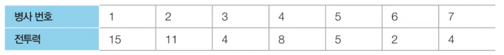
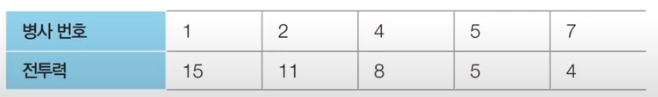
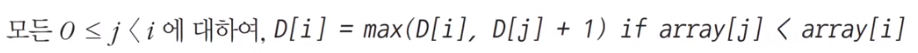
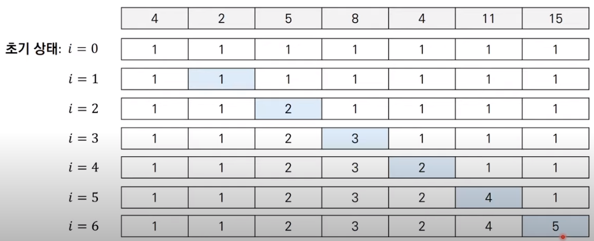

# 코딩 테스트 노트 with Python

## 8. 다이나믹 프로그래밍

### 8.10 DP 문제5 : 병사 배치하기
#### [문제 설명]
- N명의 병사가 무작위로 나열되어 있습니다. 각 병사는 특정한 값의 전투력을 보유하고 있습니다.
- 병사를 배치할 때는 **전투력이 높은 병사가 앞쪽에 오도록 내림차순으로 배치**를 하고자 합니다. 다시 말해 앞쪽에 있는 병사의 전투력이 항상 뒤쪽에 있는 병사보다 높아야 합니다.
- 또한 배치 과정에서는 특정한 위치에 있는 병사를 열외시키는 방법을 이용합니다. 그러면서도 남아있는 병사의 수가 최대가 되도록 하고 싶습니다.

- 예를 들어, N = 7일 때 나열된 병사들의 전투력이 다음과 같다고 가정하겠습니다.

    </img> 

- 이때 3번 병사와 6번 병사를 열외시키면, 다음과 같이 남아 있는 병사의 수가 내림차순의 형태가 되며 5명이 됩니다. 이는 남아 있는 병사의 수가 최대가 되도록 하는 방법입니다.

    </img> 

- 병사에 대한 정보가 주어졌을 때, 남아있는 병사의 수가 최대가 되도록 하기 위해서 열외시켜야 하는 병사의 수를 출력하는 프로그램을 작성하세요.

#### [문제 조건]
</img> 

#### [아이디어]
- 이 문제의 기본 아이디어는 **가장 긴 증가하는 부분 수열(Longest Increasing Subsequence, LIS)** 로 알려진 전형적인 다이나믹 프로그래밍 문제의 아이디어와 같습니다.
- 예를 들어 하나의 수열 array = {4, 2, 5, 8, 4, 11, 15}이 있다고 합시다.
    - 이 수열의 가장 긴 증가하는 부분 수열은 {4, 5, 8, 11, 15}입니다.
- *본 문제는 가장 긴 감소하는 부분 수열을 찾는 문제*로 치환할 수 있으므로, LIS 알고리즘을 조금 수정하여 적용함으로써 정답을 도출할 수 있습니다.

- 가장 긴 증가하는 부분 수열(LIS) 알고리즘을 확인해 봅시다.
- D[i] = array[i]를 마지막 원소로 가지는 부분 수열의 최대 길이
- 점화식은 다음과 같습니다.
    </img> 
    </img> 

- 가장 먼저 입력 받은 병사 정보의 순서를 뒤집습니다.
- 가장 긴 증가하는 부분 수열(LIS) 알고리즘을 수행하여 정답을 도출합니다.

#### [Code]
<pre>
<code>
n = int(input())
array = list(map(int, input().split()))
# 순서를 뒤집어 '최장 증가 부분 수열(LIS)' 문제로 변환
array.reverse()

# 다이나믹 프로그래밍을 위한 1차원 DP 테이블 초기화
d = [1] * n

# 가장 긴 증가하는 부분 수열(LIS) 알고리즘 수행
for i in range(1, n):
    for j in range(i):
        if array[j] < array[i]:
            d[i] = max(d[i], d[j] + 1)

# 열외해야 하는 병사의 최소 수를 출력
print(n - max(d))
</code>
</pre>