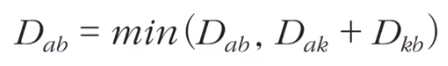
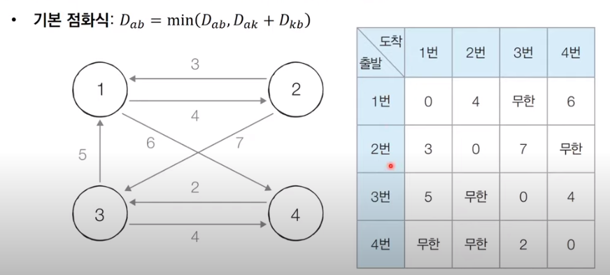
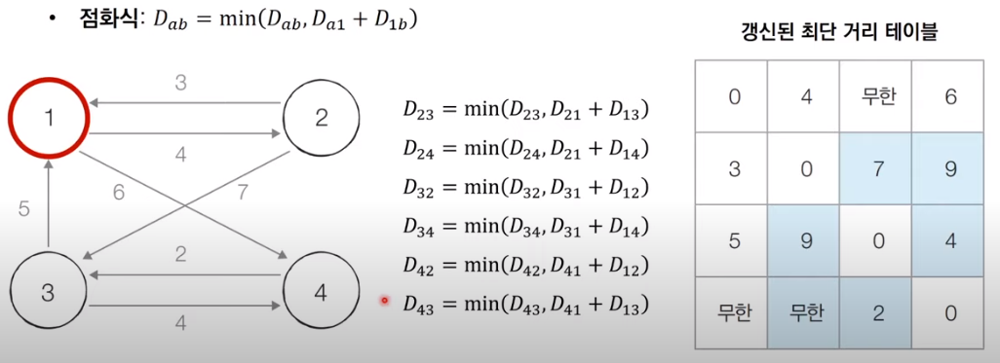
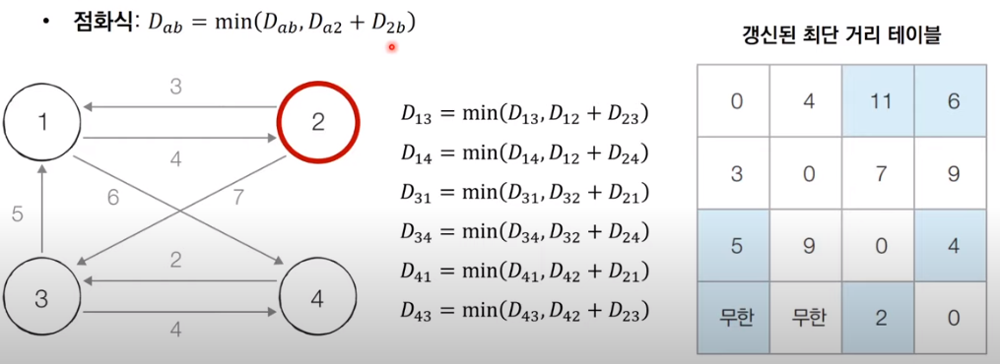
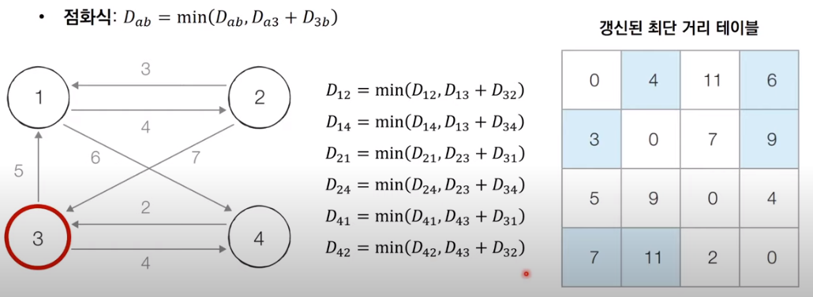
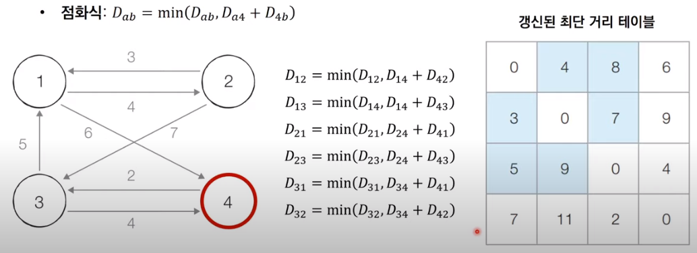

# 코딩 테스트 노트 with Python

## 9. 최단 경로 프로그래밍

### 9.6 플로이드 워셜 알고리즘
- *모든 노드에서 다른 모든 노드까지의 최단 경로를 모두 계산*합니다.
- 플로이드 워셜(Floyd-Warshall) 알고리즘은 다익스트라 알고리즘과 마찬가지로 단계별로 **거쳐 가는 노드를 기준으로 알고리즘을 수행**합니다.
    - 다만 매 단계마다 방문하지 않은 노드 중에 최단 거리를 갖는 노드를 찾는 과정(다익스트라)이 필요하지 않습니다.
- 플로이드 워셜은 **2차원 테이블에 최단 거리 정보**를 저장합니다.
- 플로이드 워셜 알고리즘은 **다이나믹 프로그래밍 유형**에 속합니다.
---
#### [점화식]
- 각 단계마다 **특정한 노드 k를 거쳐 가는 경우를 확인**합니다.
    - a에서 b로 가는 최단 거리보다 a에서 k를 거쳐 b로 가는 거리가 더 짧은지 검사합니다.
- 점화식은 다음과 같습니다.

    </img> 

 #### [동작 과정]
- [초기 상태] 그래프를 준비하고 초단 거리 테이블을 초기화합니다.

  </img> 

- [Step 1] 1번 노드를 거쳐 가는 경우를 고려하여 테이블을 갱신합니다.

  </img> 

- [Step 2] 2번 노드를 거쳐 가는 경우를 고려하여 테이블을 갱신합니다.

  </img> 

- [Step 3] 3번 노드를 거쳐 가는 경우를 고려하여 테이블을 갱신합니다.

  </img> 

- [Step 4] 4번 노드를 거쳐 가는 경우를 고려하여 테이블을 갱신합니다.

  </img> 

#### [구현 방법 : Code]
<pre>
<code>
INF = int(1e9)  # 무한을 의미하는 값으로 10억을 설정

# 노드의 개수 및 간선의 개수를 입력받기
n = int(input())
m = int(input())

# 2차원 리스트(그래프 표현)를 만들고, 무한으로 초기화
graph = [[INF] * (n + 1) for _ in range(n + 1)]

# 자기 자신에서 자기 자신으로 가는 비용은 0으로 초기화
for a in range(1, n + 1):
    for b in range(1, n + 1):
        if a == b:
            graph[a][b] = 0

# 각 간선에 대한 정보를 입력 받아, 그 값으로 초기화
for _ in range(m):
    # A에서 B로 가는 비용은 C라고 설정
    a, b, c = map(int, input().split())
    graph[a][b] = c

# 점화식에 따라 플로이드 워셜 알고리즘을 수행
for k in range(1, n + 1):
    for a in range(1, n + 1):
        for b in range(1, n + 1):
            graph[a][b] = min(graph[a][b], graph[a][k] + graph[k][b])

# 수행된 결과를 출력
for a in range(1, n + 1):
    for b in range(1, n + 1):
        # 도달할 수 없는 경우, 무한(INFINITY) 출력
        if graph[a][b] == INF:
            print("INFINITY", end=" ")
        # 도달할 수 있는 경우 거리를 출력
        else:
            print(graph[a][b], end=" ")
    print()
</code>
</pre>
입력
<pre>
<code>
4
7
1 2 4
1 4 6
2 1 3
2 3 7
3 1 5
3 4 4
4 3 2
</code>
</pre>
출력
<pre>
<code>
0 4 8 6 
3 0 7 9
5 9 0 4
7 11 2 0
</code>
</pre>
#### [성능 분석]
- 노드의 개수가 N개일 때 알고리즘 상으로 N번의 단계를 수행합니다.
    - 각 단계마다 O(N^2)의 연산을 통해 현재 노드를 거쳐 가는 모든 경로를 고려합니다.
- 따라서 플로이드 워셜 알고리즘의 총 시간 복잡도는 **O(N^3)** 입니다.