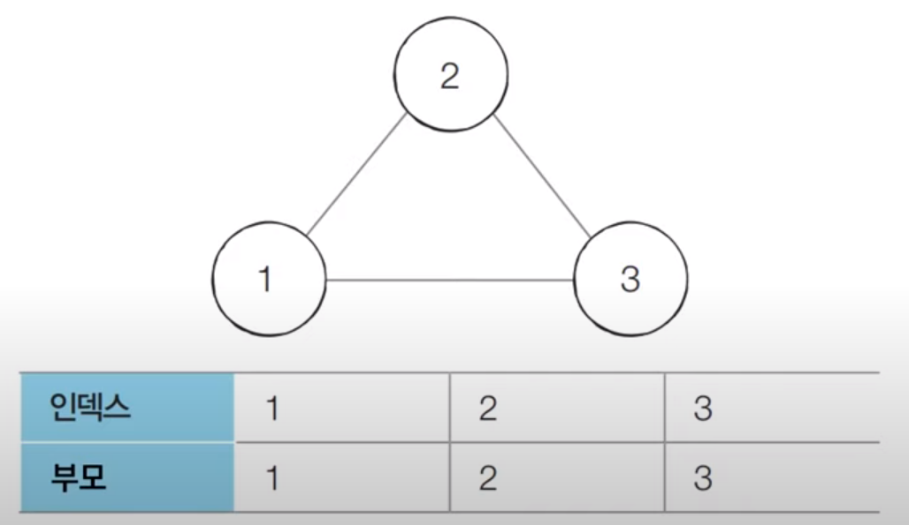

# 코딩 테스트 노트 with Python

## 10. 기타 그래프 이론

### 10.1 서로소 집합
- 서로소 집합(Disjoint Sets)이란 *공통 원소가 없는 두 집합*을 의미합니다.
  
  </img> 

#### [서로소 집합 자료구조]
- *서로소 부분 집합들로 나누어진 원소들의 데이터를 처리하기 위한 자료구조* 입니다.
- 서로소 집합 자료구조는 두 종류의 연산을 지원합니다.
  - **합집합(Union)** : 두 개의 원소가 포함된 집합을 하나의 집합으로 합치는 연산입니다.
  - **찾기(Find)** : 특정한 원소가 속한 집합이 어떤 집합인지 알려주는 연산입니다.
- 서로소 집합 자료구조는 **합치기 찾기(Union Find) 자료구조**라고 불리기도 합니다.

- 여러 개의 합치기 연산이 주어졌을 때 서로소 집합 자료구조의 동작 과정은 다음과 같습니다.
  1. 합집합(Union) 연산을 확인하여, 서로 연결된 두 노드 A, B를 확인합니다.
      - a. A와 B의 루트 노드 A', B'를 각각 찾습니다.
      - b. A'를 B'의 부모 노드로 설정합니다.
  2. 모든 합집합(Union) 연산을 처리할 때까지 1번의 과정을 반복합니다.

#### [동작 과정]
- 처리할 연산들: Union(1, 4), Union(2, 3), Union(2, 4), Union(5, 6)
- [초기 단계] 노드의 개수 크기의 부모 테이블을 초기화합니다.

  </img>

- 처리할 연산들: **Union(1, 4)**, Union(2, 3), Union(2, 4), Union(5, 6)
- [Step 1] 노드 1과 노드 4의 루트 노드를 각각 찾습니다. 현재 루트 노드는 각각 1과 4이므로 더 큰 번호에 해당하는 루트 노드 4의 부모를 1로 설정합니다.

  </img> 

- 처리할 연산들: **Union(1, 4)**, **Union(2, 3)**, Union(2, 4), Union(5, 6)
- [Step 2] 노드 2와 노드 3의 루트 노드를 각각 찾습니다. 현재 루트 노드는 각각 2와 3이므로 더 큰 번호에 해당하는 루트 노드 3의 부모를 2로 설정합니다.

  </img> 

- 처리할 연산들: **Union(1, 4)**, **Union(2, 3)**, **Union(2, 4)**, Union(5, 6)
- [Step 3] 노드 2와 노드 4의 루트 노드를 각각 찾습니다. 현재 루트 노드는 각각 2와 1이므로 더 큰 번호에 해당하는 루트 노드 2의 부모를 1로 설정합니다.

  </img> 

- 처리할 연산들: **Union(1, 4)**, **Union(2, 3)**, **Union(2, 4)**, **Union(5, 6)**
- [Step 4] 노드 5와 노드 6의 루트 노드를 각각 찾습니다. 현재 루트 노드는 각각 5와 6이므로 더 큰 번호에 해당하는 루트 노드 6의 부모를 5로 설정합니다.

  </img> 

#### [연결성]
- 서로소 집합 자료구조에서는 **연결성**을 통해 손쉽게 집합의 형태를 확인할 수 있습니다.

  </img> 

- 기본적인 형태의 서로소 집합 자료구조에서는 루트 노드에 즉시 접근할 수 없습니다.
  - 루트 노드를 찾기 위해 *부모 테이블을 계속해서 확인*하며 거슬러 올라가야 합니다.
- 다음 예시에서 노드 3의 루트를 찾기 위해서는 노드 2를 거쳐 노드 1에 접근해야 합니다.

  </img> 

#### [Code]
<pre>
<code>
# 특정 원소가 속한 집합을 찾기
def find_parent(parent, x):
    # 루트 노드를 찾을 때까지 재귀 호출
    if parent[x] != x:
        return find_parent(parent, parent[x])
    return x

# 두 원소가 속한 집합을 합치기
def union_parent(parent, a, b):
    a = find_parent(parent, a)
    b = find_parent(parent, b)
    if a < b:
        parent[b] = a
    else:
        parent[a] = b

# 노드의 개수와 간선(Union 연산)의 개수 입력 받기
v, e = map(int, input().split())
parent = [0] * (v + 1) # 부모 테이블 초기화하기

# 부모 테이블상에서, 부모를 자기 자신으로 초기화
for i in range(1, v + 1):
    parent[i] = i

# Union 연산을 각각 수행
for i in range(e):
    a, b = map(int, input().split())
    union_parent(parent, a, b)

# 각 원소가 속한 집합 출력하기
print('각 원소가 속한 집합: ', end=' ')
for i in range(1, v + 1):
    print(find_parent(parent, i), end=' ')
print()

# 부모 테이블 내용 출력하기
print('부모 테이블: ', end=' ')
for i in range(1, v + 1):
    print(parent[i], end=' ')
</code>
</pre>
입력
<pre>
<code>
6 4
1 4
2 3
2 4
5 6
</code>
</pre>
출력
<pre>
<code>
각 원소가 속한 집합:  1 1 1 1 5 5 
부모 테이블:  1 1 2 1 5 5 
</code>
</pre>

#### [기본적인 구현 방법의 문제점]
- 합집합(Union) 연산이 편향되게 이루어지는 경우 찾기(Find) 함수가 비효율적으로 동작합니다.
- 최악의 경우에는 찾기(Find) 함수가 모든 노드를 다 확인하게 되어 시간 복잡도가 O(V)입니다.
  - 다음과 같이 {1, 2, 3, 4, 5}의 총 5개의 원소가 존재하는 상황을 확인해 봅시다.
  - 수행된 연산들: Union(4, 5), Union(3, 4), Union(2, 3), Union(1, 2)

    </img> 

#### [경로 압축]
- 찾기(Find) 함수를 최적화하기 위한 방법으로 **경로 압축(Path Compression)**을 이용할 수 있습니다.
  - 찾기(Find) 함수를 재귀적으로 호출한 뒤에 *부모 테이블 값을 바로 갱신*합니다.

  <pre>
  <code>
  # 특정 원소가 속한 집합을 찾기
  def find_parent(parent, x):
    # 루트 노드가 아니라면, 루트 노드를 찾을 때까지 재귀적으로 호출
    if parent[x] != x:
        parent[x] = find_parent(parent, parent[x])
    return parent[x] 
  </code>
  </pre>

- 경로 압축 기법을 적용하면 각 노드에 대하여 *찾기(Find) 함수를 호출한 이후*에 해당 노드의 루트 노드가 바로 부모 노드가 됩니다.
- 동일한 예시에 대해서 **모든 합집합(Union) 함수를 처리한 후 각 원소에 대하여 찾기(Find) 함수를 수행하면 다음과 같이 부모 테이블이 갱신**됩니다.
- 기본적인 방법에 비하여 시간 복잡도가 개선됩니다.

    </img> 
    </img> 

#### [Code]
<pre>
<code>
# 특정 원소가 속한 집합을 찾기
def find_parent(parent, x):
    # 루트 노드를 찾을 때까지 재귀 호출
    if parent[x] != x:
        parent[x] = find_parent(parent, parent[x]) # 경로 압축
    return parent[x]

# 두 원소가 속한 집합을 합치기
def union_parent(parent, a, b):
    a = find_parent(parent, a)
    b = find_parent(parent, b)
    if a < b:
        parent[b] = a
    else:
        parent[a] = b

# 노드의 개수와 간선(Union 연산)의 개수 입력 받기
v, e = map(int, input().split())
parent = [0] * (v + 1) # 부모 테이블 초기화하기

# 부모 테이블상에서, 부모를 자기 자신으로 초기화
for i in range(1, v + 1):
    parent[i] = i

# Union 연산을 각각 수행
for i in range(e):
    a, b = map(int, input().split())
    union_parent(parent, a, b)

# 각 원소가 속한 집합 출력하기
print('각 원소가 속한 집합: ', end=' ')
for i in range(1, v + 1):
    print(find_parent(parent, i), end=' ')
print()

# 부모 테이블 내용 출력하기
print('부모 테이블: ', end=' ')
for i in range(1, v + 1):
    print(parent[i], end=' ')
</code>
</pre>
입력
<pre>
<code>
6 4
1 4
2 3
2 4
5 6
</code>
</pre>
출력
<pre>
<code>
각 원소가 속한 집합:  1 1 1 1 5 5 
부모 테이블:  1 1 1 1 5 5
</code>
</pre>

---

### 10.2 서로소 집합을 활용한 사이클 판별
- 서로소 집합은 **무방향 그래프 내에서의 사이클을 판별**할 때 사용할 수 있습니다.
  - 참고로 방향 그래프에서의 사이클 여부는 DFS를 이용하여 판별할 수 있습니다.
- **사이클 판별 알고리즘**은 다음과 같습니다.
  1. 각 간선을 하나씩 확인하며 두 노드의 루트 노드를 확인합니다.
      - a. 루트 노드가 서로 다르다면 두 노드에 대하여 합집합(Union) 연산을 수행합니다.
      - b. 루트 노드가 서로 같다면 사이클(Cycle)이 발생한 것입니다.
  2. 그래프에 포함되어 있는 모든 간선에 대하여 1번 과정을 반복합니다.

#### [동작 과정]
- [초기 단계] 모든 노드에 대하여 자기 자신을 부모로 설정하는 형태로 부모 테이블을 초기화합니다.

  </img> 

- [Step 1] 간선 (1, 2)를 확인합니다. 노드 1과 노드 2의 루트 노드는 각각 1과 2입니다. 따라서 더 큰 번호에 해당하는 노드 2의 부모 노드를 1로 변경합니다.

  </img> 

- [Step 2] 간선 (1, 3)를 확인합니다. 노드 1과 노드 3의 루트 노드는 각각 1과 3입니다. 따라서 더 큰 번호에 해당하는 노드 3의 부모 노드를 1로 변경합니다.

  </img> 

- [Step 3] 간선 (2, 3)를 확인합니다. 이미 노드 2와 노드 3의 루트 노드는 모두 1입니다. 다시 말해 **사이클이 발생**한다는 것을 알 수 있습니다.

  </img> 

#### [Code]
<pre>
<code>
# 특정 원소가 속한 집합을 찾기
def find_parent(parent, x):
    # 루트 노드를 찾을 때까지 재귀 호출
    if parent[x] != x:
        parent[x] = find_parent(parent, parent[x]) # 경로 압축
    return parent[x]

# 두 원소가 속한 집합을 합치기
def union_parent(parent, a, b):
    a = find_parent(parent, a)
    b = find_parent(parent, b)
    if a < b:
        parent[b] = a
    else:
        parent[a] = b

# 노드의 개수와 간선(Union 연산)의 개수 입력 받기
v, e = map(int, input().split())
parent = [0] * (v + 1) # 부모 테이블 초기화하기

# 부모 테이블상에서, 부모를 자기 자신으로 초기화
for i in range(1, v + 1):
    parent[i] = i

cycle = False # 사이클 발생 여부

# Union 연산을 각각 수행
for i in range(e):
    a, b = map(int, input().split())
    # 사이클이 발생한 경우 종료
    if find_parent(parent, a) == find_parent(parent, b):
        cycle = True
        break
    # 사이클이 발생하지 않았다면 합집합(Union) 연산 수행
    else:
        union_parent(parent, a, b)

if cycle:
    print("사이클이 발생했습니다.")
else:
    print("사이클이 발생하지 않았습니다.")
</code>
</pre>
입력
<pre>
<code>
3 3
1 2
1 3
2 3
</code>
</pre>
출력
<pre>
<code>
사이클이 발생했습니다.
</code>
</pre>