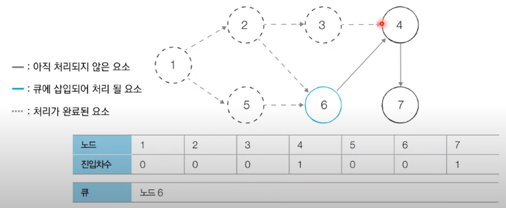

# 코딩 테스트 노트 with Python

## 10. 기타 그래프 이론

### 10.4 위상정렬(Topological Sort)
- *사이클이 없는 방향 그래프*의 모든 노드를 **방향성에 거스르지 않도록 순서대로 나열**하는 것을 의미합니다.
- 예시) 선수과목을 고려한 학습 순서 설정

  </img> 

- 위 세 과목을 모두 듣기 위한 적절한 학습 순서는?
  - 자료구조 -> 알고리즘 -> 고급 알고리즘 (O)
  - 자료구조 -> 고급 알고리즘 -> 알고리즘 (X)

#### [진입차수와 진출차수]
- 진입차수(Indegree) : 특정한 노드로 들어오는 간선의 개수
- 진출차수(Outdegree) : 특정한 노드에서 나가는 간선의 개수

  </img> 

#### [위상 정렬 알고리즘]
- **큐**를 이용하는 **위상 정렬 알고리즘의 동작 과정**은 다음과 같습니다.
  1. 진입차수가 0인 모든 노드를 큐에 넣는다.
  2. 큐가 빌 때까지 다음의 과정을 반복한다.
      - 1 ) 큐에서 원소를 꺼내 해당 노드에서 나가는 간선을 그래프에서 제거한다.
      - 2 ) 새롭게 진입차수가 0이 된 노드를 큐에 넣는다.
- 결과적으로 **각 노드가 큐에 들어온 순서가 위상 정렬을 수행한 결과**와 같습니다.

#### [동작 예시]
- 위상 정렬을 수행할 그래프를 준비합니다.
  - 이때 그래프는 **사이클이 없는 방향 그래프(DAG)** 여야 합니다.

  </img> 

- [초기 단계] 초기 단계에서는 **진입 차수가 0인 모든 노드**를 큐에 넣습니다.
  - 처음에 노드 1이 큐에 삽입됩니다.

  </img> 

- [Step 1] 큐에서 노드 1을 꺼낸 뒤에 노드 1에서 나가는 간선을 제거합니다.
  - 새롭게 진입차수가 0이 된 노드들을 큐에 삽입합니다.

  </img> 

- [Step 2] 큐에서 노드 2을 꺼낸 뒤에 노드 2에서 나가는 간선을 제거합니다.
  - 새롭게 진입차수가 0이 된 노드를 큐에 삽입합니다.

  </img> 

- [Step 3] 큐에서 노드 5을 꺼낸 뒤에 노드 5에서 나가는 간선을 제거합니다.
  - 새롭게 진입차수가 0이 된 노드를 큐에 삽입합니다.

  </img> 

- [Step 4] 큐에서 노드 3을 꺼낸 뒤에 노드 3에서 나가는 간선을 제거합니다.
  - 새롭게 진입차수가 0이 된 노드가 없으므로 그냥 넘어갑니다.

  </img> 

- [Step 5] 큐에서 노드 6을 꺼낸 뒤에 노드 6에서 나가는 간선을 제거합니다.
  - 새롭게 진입차수가 0이 된 노드를 큐에 삽입합니다.

  </img> 

- [Step 6] 큐에서 노드 4를 꺼낸 뒤에 노드 4에서 나가는 간선을 제거합니다.
  - 새롭게 진입차수가 0이 된 노드를 큐에 삽입합니다.

  </img> 

- [Step 7] 큐에서 노드 7를 꺼낸 뒤에 노드 7에서 나가는 간선을 제거합니다.
  - 새롭게 진입차수가 0이 된 노드가 없으므로 그냥 넘어갑니다.

  </img> 

- [위상 정렬 결과]
  - 큐에 삽입된 전체 노드 순서 : 1 -> 2 -> 5 -> 3 -> 6 -> 4 -> 7

    </img> 

#### [위상 정렬 특징]
- 위상 정렬은 DAG에 대해서만 수행할 수 있습니다.
  - DAG (Direct Acyclic Graph) : 순환하지 않는 방향 그래프
- 위상 정렬에서는 여러가지 답이 존재할 수 있습니다.
  - 한 단계에서 큐에 새롭게 들어가는 원소가 2개 이상인 경우가 있다면 여러가지 답이 존재합니다.
- **모든 원소를 방문하기 전에 큐가 빈다면 사이클이 존재**한다고 판단할 수 잇습니다.
  - 사이클에 포함된 원소 중에서 어떠한 원소도 큐에 들어가지 못합니다.
- 스택을 활용한 DFS를 이용해 위상 정렬을 수행할 수도 있습니다.

#### [Code]
<pre>
<code>
from collections import deque

# 노드의 개수와 간선의 개수를 입력 받기
v, e = map(int, input().split())
# 모든 노드에 대한 진입차수는 0으로 초기화
indegree = [0] * (v + 1)
# 각 노드에 연결된 간선 정보를 담기 위한 연결리스트 초기화
graph = [[] for i in range(v + 1)]

# 방향 그래프의 모든 간선 정보를 입력 받기
for _ in range(e):
    a, b = map(int, input().split())
    graph[a].append(b)  # 정점 A에서 정점 B로 이동 가능
    # 진입 차수를 1증가
    indegree[b] += 1

# 위상 정렬 함수
def topology_sort():
    result = [] # 알고리즘 수행 결과를 담을 리스트
    q = deque() # 큐 기능을 위한 deque 라이브러리 사용
    # 처음 시작할 때는 진입차수가 0인 노드를 큐에 삽입
    for i in range(1, v + 1):
        if indegree[i] == 0:
            q.append(i)
    # 큐가 빌 때까지 반복
    while q:
        # 큐에서 원소 꺼내기
        now = q.popleft()
        result.append(now)
        # 해당 원소와 연결된 노드들의 진입차수에서 1 빼기
        for i in graph[now]:
            indegree[i] -= 1
            # 새롭게 진입차수가 0이 되는 노드를 큐에 삽입
            if indegree[i] == 0:
                q.append(i)
    # 위상 정렬을 수행한 결과 출력
    for i in result:
        print(i, end = ' ')

topology_sort()
</code>
</pre>
입력
<pre>
<code>
7 8
1 2
1 5
2 3
2 6
3 4
4 7
5 6
6 4
</code>
</pre>
출력
<pre>
<code>
1 2 5 3 6 4 7
</code>
</pre>

#### [알고리즘 성능 분석]
- 위상 정렬을 위해 차례대로 모든 노드를 확인하며 각 노드에서 나가는 간선을 차례대로 제거해야 합니다.
  - 위상 정렬 알고리즘의 시간 복잡도는 **O(V + E)** 입니다.