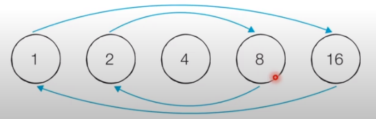
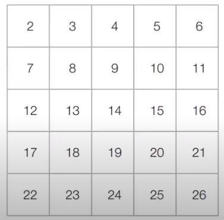
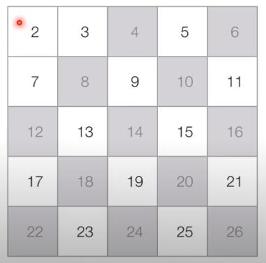
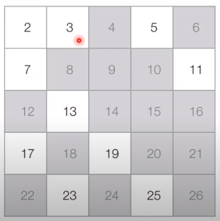
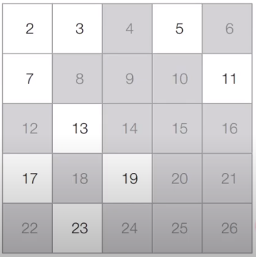

# 코딩 테스트 노트 with Python

## 11. 기타 알고리즘

### 11.1 소수 판별 알고리즘
#### 소수 (Prime Number)
- 소수란 *1보다 큰 자연수 중에서 1과 자기 자신을 제외한 자연수로는 나누어떨어지지 않는 자연수*입니다.
  - 6은 1, 2, 3 ,6으로 나우어떨어지므로 소수가 아닙니다.
  - 7은 1과 7을 제외하고는 나누어떨어지지 않으므로 소수입니다.
- 코딩 테스트에서는 어떠한 자연수가 소수인지 아닌지 판별해야 하는 문제가 자주 출제됩니다.

#### [소수의 판별 : 기본적인 알고리즘]
<pre>
<code>
# 소수 판별 함수(2이상의 자연수에 대하여)
def is_prime_number(x):
    # 2부터 (x - 1)까지의 모든 수를 확인하며
    for i in range(2, x):
        # x가 해당 수로 나누어떨어진다면
        if x % i == 0:
            return False    # 소수가 아님
    return True # 소수

print(is_prime_number(4))
print(is_prime_number(7))
</code>
</pre>
실행 결과
<pre>
<code>
False
True
</code>
</pre>

#### [소수의 판별 : 기본적인 알고리즘 성능 분석]
- 2부터 X - 1 까지의 모든 자연수에 대하여 연산을 수행해야 합니다.
  - 모든 수를 하나씩 확인한다는 점에서 시간 복잡도는 O(X)입니다.

---
#### 약수의 성질
- **모든 약수가 가운데 약수를 기준으로 곱셈 연산에 대해 대칭**을 이루는 것을 알 수 있습니다.
  - 예를 들어 16의 약수는 1, 2, 4, 8, 16입니다.
  - 이때 2 X 8 = 16은 8 X 2 = 16과 대칭입니다.
- 따라서 우리는 특정한 자연수의 모든 약수를 찾을 때 *가운데 약수(제곱근)까지만 확인*하면 됩니다.
  - 예를 들어 16이 2로 나누어떨어진다는 것은 8로도 나누어떨어진다는 것을 의미합니다.

    </img> 
  
#### [소수의 판별 : 개선된 알고리즘]
<pre>
<code>
import math

# 소수 판별 함수(2이상의 자연수에 대하여)
def is_prime_number(x):
    # 2부터 x의 제곱근까지의 모든 수를 확인하며
    for i in range(2, int(math.sqrt(x)) + 1):
        # x가 해당 수로 나누어떨어진다면
        if x % i == 0:
            return False    # 소수가 아님
    return True # 소수

print(is_prime_number(4))
print(is_prime_number(7))
</code>
</pre>
실행 결과
<pre>
<code>
False
True
</code>
</pre>

#### [소수의 판별 : 개선된 알고리즘 성능 분석]
- 2부터 X의 제곱근(소수점 이하 무시)까지의 모든 자연수에 대하여 연산을 수행해야 합니다.
  - 시간 복잡도는 O(N ^ (1/2))입니다.

---
#### 다수의 소수 판별
- 하나의 수에 대해서 소수인지 아닌지 판별하는 방법을 알아보았습니다.
- 하지만 *특정한 수의 범위 안에 존재하는 모든 소수*를 찾아야 할 때는 어떻게 할까요?
  - **에라토스테네스의 체 알고리즘**을 사용할 수 있습니다.

#### 에라토스테네스의 체 알고리즘
- *다수의 자연수에 대하여 소수 여부를 판별*할 때 사용하는 대표적인 알고리즘입니다.
- 에라토스테네스의 체는 N보다 작거나 같은 모든 소수를 찾을 떄 사용할 수 있습니다.
- 에라토스테네스의 체 알고리즘의 구체적인 동작 과정은 다음과 같습니다.
  1. 2부터 N까지의 모든 자연수를 나열한다.
  2. 남은 수 중에서 아직 처리하지 않은 가장 작은 수 i를 찾는다.
  3. 남은 수 중에서 i의 배수를 모두 제거한다. (i는 제거하지 않는다)
  4. 더 이상 반복할 수 없을 때까지 2번과 3번의 과정을 반복한다.

#### [동작 과정]
- [초기 단계] 2부터 26까지의 모든 자연수를 나열합니다. (N = 26)

  </img>

- [Step 1] 아직 처리하지 않은 가장 작은 수 2를 제외한 2의 배수는 모두 제거합니다.

  </img>

- [Step 2] 아직 처리하지 않은 가장 작은 수 3을 제외한 3의 배수는 모두 제거합니다.

  </img>

- [Step 3] 아직 처리하지 않은 가장 작은 수 5를 제외한 5의 배수는 모두 제거합니다.

  </img>

- [Step 4] 마찬가지의 과정을 반복했을 때 최정적인 결과는 다음과 같습니다.

  </img>

#### [에라토스테네스의 체 알고리즘 코드]
<pre>
<code>
import math

n = 1000    # 2부터 1,000까지의 모든 수에 대하여 소수 판별
# 처음엔 모든 수가 소수(True)인 것으로 초기화(0과 1은 제외)
array = [True for i in range(n + 1)]

# 에라토스테네스의 체 알고리즘 수행
# 2부터 n의 제곱근까지의 모든 수를 확인하며
for i in range(2, int(math.sqrt(n)) + 1):
    if array[i] == True:    # i가 소수인 경우(남은 수인 경우)
        # i를 제외한 i의 모든 배수를 지우기
        j = 2
        while i * j <= n:
            array[i * j] = False
            j += 1

# 모든 소수 출력
for i in range(2, n + 1):
    if array[i]:
        print(i, end=' ')
</code>
</pre>
실행 결과
<pre>
<code>
2 3 5 7 11 13 17 19 23 29 31 37 41 43 47 53 59 61 67 71 73 79 83 89 97 101 103 107 109 113 127 131 137 139 149 151 157 163 167 173 179 181 191 193 197 199 211 223 227 229 233 239 241 251 257 263 269 271 277 281 283 293 307 311 313 317 331 337 347 349 353 359 367 373 379 383 389 397 401 409 419 421 431 433 439 443 449 457 461 463 467 479 487 491 499 503 509 521 523 541 547 557 563 569 571 577 587 593 599 601 607 613 617 619 631 641 643 647 653 659 661 673 677 683 691 701 709 719 727 q733 739 743 751 757 761 769 773 787 797 809 811 821 823 827 829 839 853 857 859 863 877 881 883 887 907 911 919 929 937 941 947 953 967 971 977 983 991 997
</code>
</pre>

#### [에라토스테네스의 체 : 성능 분석]
- 에라토스테네스의 체 알고리즘의 시간 복잡도는 사실상 선형 시간에 가까울 정도로 매우 빠릅니다.
  - 시간 복잡도는 O(NloglogN)입니다.
- 에라토스테네스의 체 알고리즘은 다수의 소수를 찾아야 하는 문제에서 효과적으로 사용될 수 있습니다.
  - 하지만 각 자연수에 대한 소수 여부를 저장해야 하므로 **메모리가 많이 필요**합니다.
  - 10억이 소수인지 아닌지 판별해야 할 때 에라토스테네스의 체를 사용할 수 있을까요?