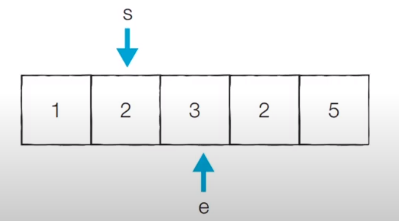
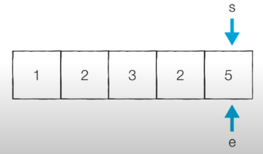

# 코딩 테스트 노트 with Python

## 11. 기타 알고리즘

### 11.2 투 포인터 (Two Pointers)
- 투 포인터 알고리즘은 *리스트에 순차적으로 접근해야 할 때 두 개의 점의 위치를 기록하면서 처리*하는 알고리즘을 의미합니다.
- 흔히 2, 3, 4, 5, 6, 7번 학생을 지목해야할 때 '2번부터 7번까지의 학생'이라고 부르곤 합니다.
- 리스트에 담긴 데이터에 순차적으로 접근해야할 때는 시작점과 끝점 2개의 점으로 접근할 데이터의 범위를 표현할 수 있습니다.

#### [문제 : 특정한 합을 가지는 부분 연속 수열 찾기]
- N개의 자연수로 구성된 수열이 있습니다.
- **합이 M인 부분 연속 수열의 개수**를 구해보세요.
- 수행 시간 제한은 **O(N)** 입니다.

  </img>

#### [아이디어 : 특정한 합을 가지는 부분 연속 수열 찾기]
- **투 포인터를 활용**하여 다음과 같은 알고리즘으로 문제를 해결할 수 있습니다.
  1. 시작점(start)과 끝점(end)이 첫 번째 원소의 인덱스(0)를 가리키도록 한다.
  2. 현재 부분 합이 M과 같다면, 카운트한다.
  3. 현재 부분 합이 M보다 작다면, end를 1 증가시킨다.
  4. 현재 부분 합이 M보다 크거나 같다면, start를 1 증가시킨다.
  5. 모든 경우를 확인할 때까지 2부터 4번까지의 과정을 반복한다.

      </img>

#### [동작 과정]
- M = 5
- [초기 단계] 시작점과 끝점이 첫 번째 원소의 인덱스를 가리키도록 합니다.
  - 현재의 부분합은 1이므로 무시합니다.
  - 현재 카운트 : 0

  </img>

- [Step 1] 이전 단계에서 부분합이 1이었기 때문에 end를 1 증가시킵니다.
  - 현재의 부분합은 3이므로 무시합니다.
  - 현재 카운트 : 0

  </img>

- [Step 2] 이전 단계에서 부분합이 3이었기 때문에 end를 1 증가시킵니다.
  - 현재의 부분합은 6이므로 무시합니다.
  - 현재 카운트 : 0

  </img>

- [Step 3] 이전 단계에서 부분합이 6이었기 때문에 start를 1 증가시킵니다.
  - 현재의 부분합은 5이므로 카운트를 증가시킵니다.
  - 현재 카운트 : 1

  </img>

- [Step 4] 이전 단계에서 부분합이 5이었기 때문에 start를 1 증가시킵니다.
  - 현재의 부분합은 3이므로 무시합니다.
  - 현재 카운트 : 1

  </img>

- [Step 5] 이전 단계에서 부분합이 3이었기 때문에 end를 1 증가시킵니다.
  - 현재의 부분합은 5이므로 카운트를 증가시킵니다.
  - 현재 카운트 : 2

  </img>

- [Step 6] 이전 단계에서 부분합이 5이었기 때문에 start를 1 증가시킵니다.
  - 현재의 부분합은 2이므로 무시합니다.
  - 현재 카운트 : 2

  </img>

- [Step 7] 이전 단계에서 부분합이 2였기 때문에 end를 1 증가시킵니다.
  - 현재의 부분합은 7이므로 무시합니다.
  - 현재 카운트 : 2

  </img>

- [Step 8] 이전 단계에서 부분합이 7이었기 때문에 start를 1 증가시킵니다.
  - 현재의 부분합은 5이므로 카운트를 증가시킵니다.
  - 현재 카운트 : 3

  </img>

#### [알고리즘 코드]
<pre>
<code>
n = 5   # 데이터의 개수 N
m = 5   # 찾고자 하는 부분합 M
data = [1, 2, 3, 2, 5]

count = 0
interval_sum = 0
end = 0

# start를 차례대로 증가시키며 반복
for start in range(n):
    # end를 가능한 만큼 이동시키기
    while interval_sum < m and end < n:
        interval_sum += data[end]
        end += 1
    # 부분합이 m일 때 카운트 증가
    if interval_sum == m:
        count += 1
    interval_sum -= data[start]

print(count)
</code>
</pre>
실행 결과
<pre>
<code>
3
</code>
</pre>