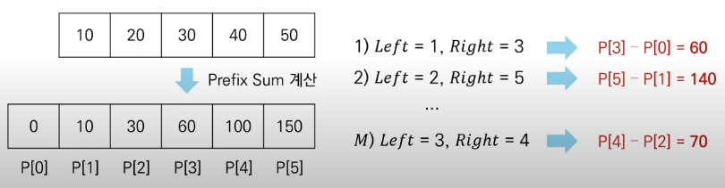

# 코딩 테스트 노트 with Python

## 11. 기타 알고리즘

### 11.3 구간 합 (Interval Sum)
- 구간 합 문제 : 연속적으로나열된 N개의 수가 있을 때 *특정 구간의 모든 수를 합한 값을 계산*하는 문제
- 예를 들어 5개의 데이터로 구성된 수열 {10, 20, 30, 40, 50}이 있다고 가정합시다.
  - 두 번째 수부터 네 번째 수까지의 합은 20 + 30 + 40 = 90입니다.

#### [문제 : 구간 합 빠르게 계산하기]
- N개의 정수로 구성된 수열이 있습니다.
- M개의 쿼리(Query) 정보가 주어집니다.
  - 각 쿼리는 Left와 Right로 구성됩니다.
  - 각 쿼리에 대하여 [Left, Right] 구간에 포함된 데이터들의 합을 출력해야 합니다.
- 수행 시간 제한은 **O(N + M)** 입니다.

#### [아이디어 : 구간 합 빠르게 계산하기]
- **접두사 합(Prefix Sum)** : 배열의 맨 앞부터 특정 위치까지의 합을 미리 구해 놓은 것
- 접두사 합을 활용한 알고리즘은 다음과 같습니다.
  - N개의 수 위치 각각에 대하여 접두사 합을 계산하여 P에 저장합니다.
  - 매 M개의 쿼리 정보를 확인할 때 구간 합은 P[Right] - P[Left - 1]입니다.

  </img>

#### [알고리즘 코드]
<pre>
<code>
# 데이터의 개수 N과 데이터 입력받기
n = 5
data = [10, 20, 30, 40, 50]

# 접두사 합(Prefix Sum) 배열 계산
sum_value = 0
prefix_sum = [0]
for i in data:
    sum_value += i
    prefix_sum.append(sum_value)

# 구간 합 계산(세 번째 수부터 네 번째 수까지)
left = 3
right = 4
print(prefix_sum[right] - prefix_sum[left - 1])
</code>
</pre>
실행 결과
<pre>
<code>
70
</code>
</pre>