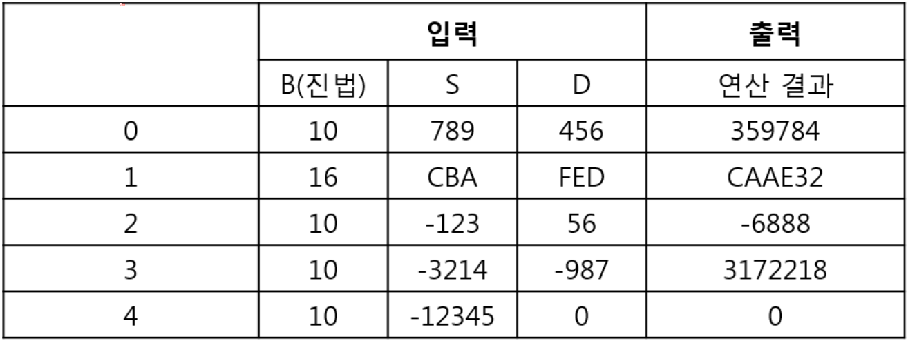

# 2. 계산기
## 2.1. 문제설명
- B(B = 자연수, 2 <= B <= 36)진법의 수를 입력 받아 사칙 연산하는 계산기를 개발 중이다. 이승훈 연구원은 곱셈 부분을 구현해야 한다.

## 2.2 요구사항
- 테스트 케이스는 총 N(N = 자연수, 5 <= N <= 100)번으로, 각 테스트 케이스는 100자리 이하의 B진법 정수를 두 개 입력 받아서, 이를 곱셈한 결과를 구해서 출력해야 한다.
- 입력 정수가 음수인 경우 '-'기호가 정수 맨 앞에 붙는다. 연산 결과가 음수인 경우 '-'기호를 맨 앞에 붙여서 출력한다. 입력 정수가 B진법이면 연산 결과도 B진법으로 출력한다.

### <값 범위>
1. 테스트 케이스 수 N(N = 자연수, 5 <= N <= 100)
2. B 진법(B = 자연수, 2 <= B <= 36), 사용 문자 '0'~'9','A'~'Z'
3. 입력되는 B진법 정수 S, D의 자릿수(1 <= 자릿수 <= 100)

- 예를 들어, 테스트 케이스가 5개이고 입력이 다음 표와 같다면,
</img>
- 출력은 위의 표와 같다.
- 음수일 경우 반드시 '-'부호를 붙여야 하며, 출력 결과에 의미 없는 '0'이 붙을 경우 오답 처리됨에 주의. 예를 들어, '123'이 결과인데 '0123'으로 출력하면 오답임.
- 11진법 이상 사용시 10 이상의 수는 알파벳 대문자로 대체. 'A'=10, 'B'=11, ..., 'Z'=35 임. 결과 출력 시에도 대문자만 사용해야 함. 소문자 사용시 오답임.

## 2.3. 문제
- 테스트 케이스 수 N과 N줄에 걸쳐 입력 B, S, D가 입력되면 그 결과를 각각 한 줄에 출력하시오.
### <입력 형식>
- 첫 번째 줄에는 테스트 케이스 수 N(N = 자연수, 5 <= N <= 100)
- 두 번째 줄부터 N줄에 걸쳐 B(B = 자연수, 2 <= B <= 36), S(S=문자열, 사용 문자 '0'~'9','A'~'Z', 1 <= S의 자릿수 <= 100), D(D=문자열, 사용 문자 '0'~'9','A'~'Z', 1 <= D의 자릿수 <= 100)가 공백으로 구분되어 입력(B 진법에 위배되는 입력 없음)

### <출력 형식>
- 테스트 케이스 별로 한 줄에 한 개씩 곱셈 결과를 출력

입력
<pre>
<code>
5
10 789 456
16 CBA FED
10 -123 56
10 -3214 -987
10 -12345 0
</code>
</pre>

출력
<pre>
<code>
359784
CAAE32
-6888
3172218
0
</code>
</pre>

## 2.4 Code
<pre>
<code>

</code>
</pre>

---
## 2.5 문제해결 아이디어
- 