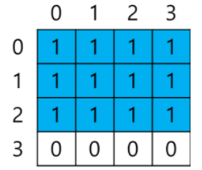
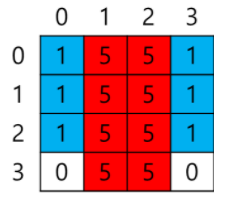
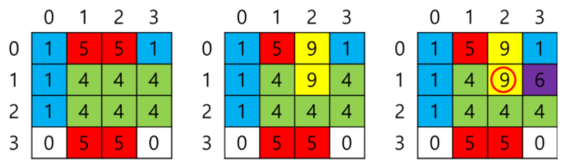

# 12. 색종이
## 12.1. 문제 설명
- 색종이 게임은 N * N 크기의 흰색 도화지에 최대 9장(모두 다른 색)의 색종이를 직사각형 모양으로 붙인다. 색종이가 가장 많이 겹쳐진 부분을 문서 천공기로 뚫으면 된다. 한 번의 천공기로 뚫을 수 있는 색종이의 최대 장수를 구하시오.

## 12.2. 요구 사항
- 색종이 게임의 준비물은 N * N 크기의 흰색 도화지(0번 색으로 표시)와  1 ~ 9번 색의 색종이 이다. 색종이는 흰색 도화지의 크기보다 작거나 같을 수 있으며 직사각형 모양이다. 흰색 도화지에 색종이를 임의의 지점부터 도화지와 평행이 되도록 붙인다. 다른 색 위에 겹쳐서 붙일 수 도 있고 빈 곳에 붙일 수 도 있다. 단, 남은 부분으로 색종이 원래 모양을 유추할 수 있도록 붙여야 한다.

- 이제 게임 참가자는 이 종이에서 임의의 한 부분을 문서 천공기로 구멍을 뚫어서 겹쳐진 색종이의 수를 세어본다. 가장 많이 겹쳐진 부분을 뚫으면 승리하게 된다.

- 예를 들어, 도화지 크기 N이 4일 떄, 먼저 4(가로) * 3(세로) 크기에 1번 색인 색종이를 (0(가로), 0(세로))지점부터 붙이면 아래와 같은 모양이 된다.

   </img>

- 두 번째로 2 * 4 크기에 5번 색인 색종이를 (1, 0)지점부터 붙이면 아래와 같은 모양으로 바뀐다.

   </img>

- 세 번째로 3 * 2 크기에 4번 색인 색종이를 (1, 1)지점부터 붙이고, 네 번째로 1 * 2 크기에 9번의 색종이를 (2, 0) 지점부터 붙이고, 마지막으로 1 * 1 크기에 6번 색인 색종이를 (3, 1)지점부터 붙이면 아래와 같이 된다.

   </img>

- 색종이가 최대로 겹쳐진 곳은 (2, 1)이고 4장이다.

## 12.3. 문제
- 도화지 크기 N과 도화지에 붙여진 색종이 정보가 주어질 때, 한 번의 천공기로 뚫을 수 있는 색종이의 최대 장수를 구하시오.

### <입력 형식>
- 첫 번째 줄에는 도화지 크기 N이 입력(N은 정수, 4 <= N <= 10)
- 두 번째 줄부터 N줄에 걸쳐서 N개씩 색 정보가 공백 없이 입력(색 정보는 정수, 0 <= 색 정보 <= 9, 0이면 빈 공간)

### <출력 형식>
- 한 번의 천공기로 뚫을 수 있는 색종이의 최대 장수를 출력

- 예시 1
입력 
<pre>
<code>
4
1591
1496
1444
0550
</code>
</pre>

출력
<pre>
<code>
4
</code>
</pre>

## 12.4 Code
- 나의 코드 (TestCase 통과)
<pre>
<code>
# 색종이

N = int(input()) #도화지 크기
# A = [ input() for _ in range(N) ] #도화지 색정보

graph = [[] * N for _ in range(N)]
result = [[0] * N for _ in range(N)]

for i in range(N):
	temp = input()
	for j in range(len(temp)):
		graph[i].append(int(temp[j]))

# print(graph)

for color in range(1, 10):
	minI = minJ = 10
	maxI = maxJ = 0

	for i in range(N):
		for j in range(N):
			if graph[i][j] == color:
				# print(i, j)
				if minI > i: minI = i
				if minJ > j: minJ = j
				if maxI < i: maxI = i
				if maxJ < j: maxJ = j
	if minI == 10: continue
		
	# print(minI, minJ, maxI, maxJ)
		
	for i in range(minI, maxI+1):
		for j in range(minJ, maxJ+1):
			result[i][j] += 1

m = 0
for i in range(N):
	m = max(m, max(result[i]))

print(m)
</code>
</pre>

- 정답 코드
<pre>
<code>
N = int(input())
A = [input() for _ in range(N)]
pos = dict()
base = "123456789"
for i in base:
    pos[i] = [10, 10, -1, -1]

for i in range(N):
    for j in range(N):
        if A[i][j] != '0':
            pos[A[i][j]][0] = min(pos[A[i][j]][0], i)
            pos[A[i][j]][1] = min(pos[A[i][j]][1], j)
            pos[A[i][j]][2] = max(pos[A[i][j]][2], i)
            pos[A[i][j]][3] = max(pos[A[i][j]][3], j)

B = [[0 for _ in range(N)] for _ in range(N)]
for b in base:
    y1, x1, y2, x2 = pos[b]
    for i in range(y1, y2 + 1):
        for j in range(x1, x2 + 1):
    	    B[i][j] += 1

ans = 0
for b in B:
    ans = max(ans, max(b))
print(ans)
</code>
</pre>

## 12.5 문제해결 아이디어
### [나의 아이디어]
- 색 1 ~ 9의 도화지내 최대/최소 row, column을 구한다. (전체 색종이를 그릴 수 있음)
- 찾아진 최대/최소 row, column구간을 순회하여 result에 +1을 한다.(덮어진 최종 색종이의 수를 반환하도록)
- 2차원 배열의 최대값을 반환한다.
	- 열에서 최대 값과 현재 최대값을 비교하며 갱신한다.

### [정답 아이디어]
- 동일