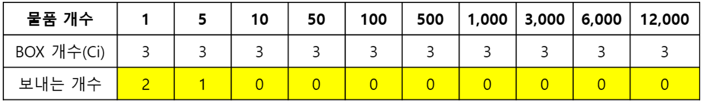
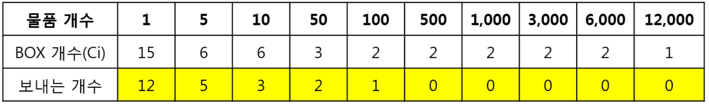

# 10. 불우이웃 돕기
## 10.1. 문제 설명
- LG그룹 사회공헌팀에서 불우이웃을 돕기 위해 물품을 기부 받겠다고 연락이 왔다. 재고 관리자는 N개의 물품을 보낼 예정이다. 창고에는 물품들이 다양한 개수의 BOX로 포장되어 있는데 효율적인 창고 관리를 위해서 최대한 많은 BOX를 보내려고 한다.

## 10.2. 요구 사항
- 창고에는 물품들이 다양한 개수로 포장되어 있다. BOX크기에 따라 들어있는 물품 개수가 (1, 5, 10, 50, 100, 500, 1000, 3000, 6000, 12000)개로 10종류가 있다. 각 종류 BOX의 개수 Ci는 마찬가지로 다양하다.

- 재고 관리자는 물품 N개를 정확하게 보내면서도 최대한 많은 BOX를 보내서 창고를 최대한 비우고 싶다. 하지만 어떻게 보내야 할지 난감한 관리자 눈에 신입 연구원이 눈에 띄었다. 신입 연구원에게 정확하게 N개를 보내면서도 최대한 많은 BOX를 보내는 방법을 알려달라고 하였다. 신입 연구원 이승훈은 이번 기회에 자신의 능력을 보여주고 싶다. 신입 연구원 이승훈을 도와주자.

- 예를 들어, 물품 개수 N은 7개 이고, 재고 현황이 아래 표와 같을 경우,

    </img>
- 위의 표와 같이 보내면, 3개의 BOX를 보낼 수 있고 이 방법보다 더 좋은 방법은 없다.

- 예를 들어, 물품 개수 N은 267개 이고, 재고 현황이 아래 표와 같을 경우,

    </img>
- 위의 표와 같이 보내면, 23개의 BOX를 보낼 수 있고 이 방법보다 더 좋은 방법은 없다.

### [값 범위]
1. 보내려는 물품 개수 N (N = 자연수, 1 <= N <= 453,320) 
2. BOX 개수 Ci (Ci = 정수, 0 <= Ci <= 20)

## 10.3. 문제
- 보내려는 물품 개수 N과 각 종류의 BOX개수 Ci가 주어질 때, 정확하게 N개를 보내면서도 최대한 많은 BOX를 보낼 때 BOX의 총 개수와 각 종류별로 몇 BOX를 보내면 되는지 구하시오.

### <입력 형식>
- 첫 번째 줄에는 보내려는 물품 개수 N (N = 자연수, 1 <= N <= 453,320) 이 입력
- 두 번째 줄에는 10 종류 BOX의 재고 현황 Ci (Ci = 정수, 0 <= Ci <= 20)가 공백으로 구분되어 입력 (1, 5, 10, 50, 100, 500, 1000, 3000, 6000, 12000 순으로 입력 됨) (N개를 보낼 수 없는 입력은 없음을 보장 함)

### <출력 형식>
- 첫 번째 줄에는 보내는 BOX의 총 개수를 출력
- 두 번째 줄에는 10종류 BOX의 보내는 개수를 순서대로 출력 (1, 5, 10, 50, 100, 500, 1000, 3000, 6000, 12000 순으로 출력, 보내는 개수가 없으면 0을 출력)

입력
<pre>
<code>
7
3 3 3 3 3 3 3 3 3 3
</code>
</pre>

출력
<pre>
<code>
3
2 1 0 0 0 0 0 0 0 0 
</code>
</pre>

## 10.4 Code
<pre>
<code>

</code>
</pre>

## 10.5 문제해결 아이디어
- 작은 것부터 많이 Box를 채워야 치울 수 있는 BOX가 늘어남
- 선택한 만큼 N의 값을 빼면서 넘어가야함
    - 기저 조건 : N == 0이면 MAX보다 크면 갈아치우고 N <0 보다 작아지면 return
