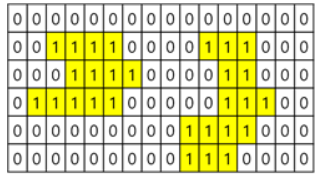
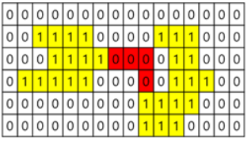

# 8. 무인 열차
## 8.1. 문제 설명
- 사업확장으로 생산라인 2동을 새로 건설하였다. 2곳의 생산라인은 긴밀한 협조가 이루어져야 하는 곳이므로 2곳을 연결하여 부품의 공급이 원활하게 하고자 한다. 2곳을 연결하기 위한 레일 모듈의 최소 개수를 계산해 보자.

## 8.2. 요구 사항
- 사업확장으로 생산라인 2동을 새로 건설하여 L1동에서 생산된 부품을 L2동으로 공급하기 위하여 무인 열차를 운행할 예정이나 L1동의 출발지와 L2동의 도착지를 아직 결정을 못한 상황이다.

- 무인 열차는 1 * 1의 격자크기에 맞는 레일 모듈을 여러 개 연결하여 만든 레일위를
 상하좌우로 이동할 수 있다. 무인 열차의 출발지와 종착지 결정을 위해 레일 모듈 크기에 맞게 건물은 1로 주변 황무지는 0으로 표시하는 세로 N, 가로 M크기의 지도를 제작 하였다.

- L1동의 출발지와 L2동의 도착지를 아무 곳이나 정한다면 황무지에 여러 개의 레일 모듈을 설치해야 하나 건설비용을 줄이기 위해 최소한의 레일 모듈을 사용하는 곳에 출발지와 도착지를 지정하려 한다.

- 예를 들어 N이 6(세로), M이 16(가로)인 다음과 같은 사진이 주어질 때, 1로 표시된 노란 영역 두 부분 중 한 부분은 L1동, 다른 한 부분은 L2동이다.
    
    </img>

- 이 두 생산라인을 레일 모듈로 연결하기 위해서 아래 그림처럼 적색 부분에 설치하면 두 생산라인이 연결되게 된다. 물론, 다른 영역에 4개의 레일 모듈을 설치 하여도 된다. 그러나 최소량은 4개로 동일하다.

    </img>

## 8.3. 문제
- 지도를 분석하여 L1동과 L2동을 연결하기 위한 최소 레일 모듈의 수를 구하시오.

### <입력 형식>
- 첫 번째 줄에는 지도의 세로크기 N (N = 정수, 1 <= N <= 50)과 가로 크기 M (M = 정수, 1 <= M <= 50)
- 두 번째 줄에는 N줄에 걸쳐 M개의 0과 1로 구성된 숫자가 공백으로 구분되어 입력

### <출력 형식>
- 두 생산라인을 연결시키기 위한 최소한의 레일 모듈의 개수를 출력

입력
<pre>
<code>
6 16
0 0 0 0 0 0 0 0 0 0 0 0 0 0 0 0 
0 0 1 1 1 1 0 0 0 0 1 1 1 0 0 0 
0 0 0 1 1 1 1 0 0 0 0 1 1 0 0 0 
0 1 1 1 1 1 0 0 0 0 0 1 1 1 0 0 
0 0 0 0 0 0 0 0 0 1 1 1 1 0 0 0 
0 0 0 0 0 0 0 0 0 1 1 1 0 0 0 0 
</code>
</pre>

출력
<pre>
<code>
4
</code>
</pre>

## 8.4 Code
<pre>
<code>

</code>
</pre>
