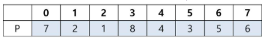
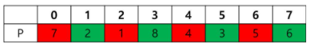
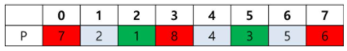

# 7. 마리오 게임
## 7.1. 문제 설명
- 직원들의 사기 진작과 수학 능력을 테스트 하기 위해 마리오 게임을 개최하기로 하였다. 이승훈 연구원은 마리오 게임에서 우승을 해서 능력을 과시하고 싶다.

## 7.2. 요구 사항
- 마리오 게임은 버섯을 규칙에 맞게 먹어서 키를 최대한 키우는 단순한 게임으로 가장 키를 많이 키운 사람이 우승이다.

### [값 범위]
1. 버섯의 개수 N (N = 자연수, 1 <= N <= 150,000)
2. 버섯은 일렬로 늘어져 있으며 0번 부터 N-1번까지 있음
3. 버섯에 써있는 숫자 P (P = 자연수, 1 <= P <= 500)

### [버섯을 먹는 규칙]
1. 버섯은 0번 부터 순서대로 먹을지 먹지 않을지 결정해야 함
2. 첫 번째로 먹은 버섯의 숫자만큼 키가 커짐
3. 두 번째로 먹은 버섯의 숫자만큼 키가 작아짐
4. 즉, 홀수 번째로 먹은 버섯의 숫자만큼 커지고 짝수 번째로 먹은 숫자만큼 작아짐

- 입력 1에서 8개의 버섯이 아래 표와 같이 주어질 때,

    </img>

- 버섯을 모두 먹으면, 7 - 2 + 1 - 8 + 4 - 3 + 5 - 6 = -2가 됨.

    </img>
- 홀수 번째로 먹은 0번, 2번, 4번, 6번 버섯의 값만큼 커지고 짝수 번째로 먹은 1번, 3번, 5번, 7번 버섯의 값만큼 작아진다.

- 버섯 0번, 2번, 3번, 5번, 7번 이렇게 5개의 버섯을 먹으면, 7 - 1 + 8 - 3 + 6 = 17이 되고 이 값이 최대로 키를 키울 수 있는 값임.

    </img>
- 홀수 번째로 먹은 0번, 3번, 7번 버섯의 값만큼 커지고 짝수 번째로 먹은 2번, 5번 버섯의 값만큼 작아진다.

## 7.3. 문제
- 버섯 수 N과 각 버섯의 값 P가 주어질 때, 마리오의 키를 최대한 키웠을 때의 값을 찾아서 출력하시오.

### <입력 형식>
- 첫 번째 줄에는 버섯 수 N이 입력 (N = 자연수, 1 <= N <= 150,000)
- 두 번째 줄에는 N개의 버섯의 값 P가 공백으로 구분되어 입력 (버섯 번호 0번 부터 N-1번까지 순서대로 입력) (P = 자연수, 1 <= P <= 500)

### <출력 형식>
- 버섯을 적절하게 먹었을 때 키울 수 있는 최대값을 출력

입력
<pre>
<code>
8
7 2 1 8 4 3 5 6 
</code>
</pre>

출력
<pre>
<code>
17
</code>
</pre>

## 7.4 Code
<pre>
<code>

</code>
</pre>
