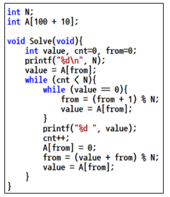
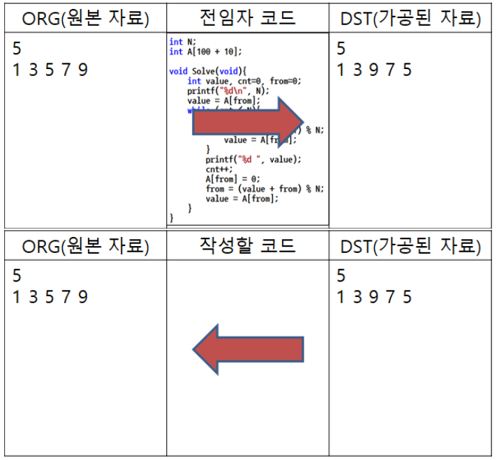

# 4. 자료
## 4.1. 문제설명
- 이승훈 연구원은 고민에 빠졌다. 새로운 업무를 배정 받았는데 이전 담당자가 자료를 제대로 남겨 놓지 않았기 때문이다. 원본 자료는 없고 전임자가 가공한 자료만 남아있다. 다행히 가공할 때 사용한 코드는 남아있는 상태이다. 이 코드를 분석해서 원래 자료를 복원해야 한다.

## 4.2 요구사항
- 원본 자료를 ORG, 가공된 자료를 DST라고 하자. 현재 ORG는 없고 DST만 남아있다. 이승훈 연구원에게 필요한 자료는 ORG이다. 다행히 전임자가 ORG를 DST로 가공할 때 사용한 소스 코드는 남아있는 상태이다.

- 아래 코드는 C언어로 작성된 코드이며 다른 언어로 작성된 소스 코드는 언어별로 주어진 template에 주석처리 되어있다. 핵심 일부만 발췌한 내용이다.

    </img>
<pre>
<code>
'''
import sys

def input_data():
	readl = sys.stdin.readline
	N = int(readl())
	A = list(map(int, readl().split()))    
	return N, A

def Solve():
	value, cnt, fr = 0, 0, 0

	print(N)
	value = A[fr]
	while cnt < N:
		while value == 0:
			fr = (fr + 1) % N
			value = A[fr]
		print(value,end = ' ')
		cnt+=1
		A[fr] = 0
		fr = (value + fr) % N
		value = A[fr]
	return

N, A = input_data()
Solve()
'''
</code>
</pre>

- 위의 코드를 이용해서 ORG가 DST로 가공 되었다.
- 예를 들어, N = 5 이고, ORG가 (1, 3, 5, 7, 9)이면 위의 코드를 이용해서 (1, 3, 9, 7, 5)로 가공된 것이다.
- 아래 그림을 참고하시오.

</img>

## 4.3. 문제
- 여러분이 할 일은 이승훈 연구원을 도와서 DST를 넣으면 다시 ORG를 만드는 코드를 작성하는 것이다.

### <입력 형식>
- 첫 번째 줄에는 데이터 개수 N이 입력 (N은 정수, 3 <= N <= 30)
- 두 번째 줄에는 N개의 데이터 Ai가 공백으로 구분되어 입력 (Ai는 정수, 1 <= Ai <= 100)

### <출력 형식>
- DST(가공된 자료)의 ORG(원본 자료)를 복원해서 출력

### 예시 1
입력
<pre>
<code>
5
1 3 9 7 5
</code>
</pre>

출력
<pre>
<code>
5
1 3 5 7 9
</code>
</pre>

### 예시 2
입력
<pre>
<code>
10
1 2 4 8 6 3 7 5 10 9
</code>
</pre>

출력
<pre>
<code>
10
1 2 3 4 5 6 7 8 9 10
</code>
</pre>

### 예시 3
입력
<pre>
<code>
10
5 5 7 4 33 10 9 3 2 6
</code>
</pre>

출력
<pre>
<code>
10
5 7 33 2 6 5 10 9 4 3
</code>
</pre>

### 예시 4
입력
<pre>
<code>
15
30 100 90 11 22 33 44 55 66 77 88 99 100 98 97
</code>
</pre>

출력
<pre>
<code>
15
30 100 33 100 55 44 77 99 22 88 97 90 11 98 66
</code>
</pre>

## 4.4 Code
<pre>
<code>

</code>
</pre>