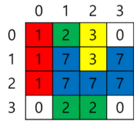
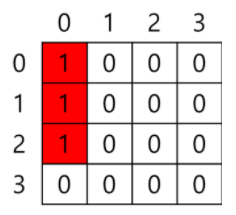
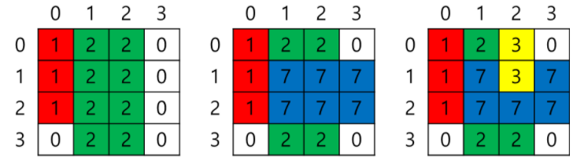

# 3. 그림인식
## 3.1. 문제설명
- 그림인식 성능 테스트를 진행 중이다. 테스트를 위해 N * N 크기의 흰색 도화지에 여러 가지 색을 임의의 순서로 직사각형 모양으로 칠을 한다.
- 색칠된 도화지를 그림 인식을 통해 덧칠하지 않은 색의 개수를 찾으려고 한다.

## 3.2 요구사항
- 테스트를 위해 N * N 크기의 흰색 도화지와 1~9번 색을 준비했다. 만드는 방법은 9가지 색 중 한 가지 색을 선택해서 직사각형 모양으로 색칠을 한다. 다른 색 위에 덧칠 할 수도 있고 빈 공간에 색칠할 수 도 있다. 몇 가지 색이 칠해졌는지 알려주지 않는다.

- 테스트를 위해 색별 덧칠 관계가 명확하게 주어진다. 덧칠 할 때는 남은 부분으로 그 색의 전체 크기를 알 수 있게 칠할 예정이다. 도화지 색은 0으로 표시한다. 즉, 0이면 색이 칠해지지 않았음을 의미한다.

- 예를 들어, 도화지 크기 N이 4이고, 주어진 그림이 아래와 같다면

    </img>

- 아래와 같이 유추해 볼 수 있다.

    </img>

- 먼저 1번 색을 (0, 0)부터 (3 * 1)칸 칠을 한다. (세로 * 가로) 순서임.

    </img>

- 그 다음에 2번 색을 (0, 1)부터 (4 * 2)칸 칠을 하고, 7번 색을 (1, 1)부터 (2 * 3)칸 칠하며, 마지막으로 3번 색을 (0, 2) 부터 (2 * 1)칸 칠했을 것이다.

- 1번 색과 2번 색은 다른 색 위에 덧칠하지 않은 색이다. 그러므로 답은 2이다.
- 3번 색은 2, 7번 색 위에 색칠했으며, 7번 색은 2번 색 위에 색칠을 했으므로 답에서 제외된다.

## 3.3. 문제
- 도화지 크기 N과 그려진 최종 모양이 주어질 때, 덧칠하지 않은 색의 개수를 구하시오.

### <입력 형식>
- 첫 번째 줄에는 도화지 크기 N이 입력 (N은 정수, 4 <= N <= 10)
- 두 번째 줄부터 N줄에 걸쳐서 N개씩 색 정보가 공백 없이 입력 (색 정보는 정수, O <= 색 정보 <= 9, 0이면 도화지 색으로 색칠이 안되었음을 의미함)

### <출력 형식>
- 도화지에 보이는 색 중에 덧칠하지 않은 색의 개수를 출력

입력
<pre>
<code>
4
1230
1737
1777
0220
</code>
</pre>

출력
<pre>
<code>
2
</code>
</pre>

## 3.4 Code
<pre>
<code>

</code>
</pre>