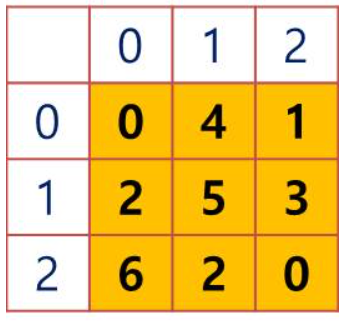
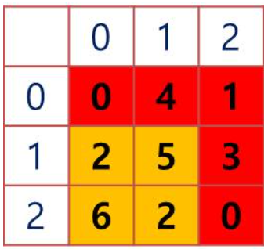

# 5. 도로건설
## 5.1. 문제설명
- 본사에서 공장까지 도로를 건설하려고 한다. 최소 비용으로 도로를 건설하고자 하는데, 그러기 위해서는 토지 구입 비용을 최소화 해야 한다.
- 지도 정보가 주어졌을 때, 토지를 구입하는데 드는 최소 비용을 구하시오.

## 5.2 요구사항
### [지도 정보]
1. 지도는 정사각형 모양으로 크기 N (N = 자연수, 2 <= N <= 100)
2. 토지는 1 * 1 크기로 나눠져 있으며 문자열로 각 토지 구입 가격이 제공됨
3. 구입가격이 0원인 경우는 이미 회사 소유의 토지임을 의미함

### [토지 구매 시 주의사항]
1. 도로는 상하좌우로 연결되어야 함 (대각선으로 연결은 불가능)
2. 본사는 (0, 0) 위치이며, 공장은 (N-1, N-1) 위치임 (이 땅들은 이미 회사 소유이므로 0원) (0, 0) 표시는 (세로좌료, 가로좌표)를 의미함.

- 입력 1의 지도 크기 N은 3이고 입력 정보는 다음 표와 같다.
	
	</img>

- 본사 (0, 0)에서 공장 (2, 2)까지 도로를 건설하기 위해 구입해야 하는 토지를 최소 비용으로 구입하려면 (0, 1), (0, 2), (1, 2)을 구입해야 함.
- 이 때, 비용은 4 + 1 + 3 = 8억임

	</img>

## 5.3. 문제
- 지도 크기 N과 지도 정보가 주어졌을 때, 토지 구입에 필요한 최소 비용을 구하시오.

### <입력 형식>
- 첫 번째 줄에 지도 크기 N이 입력 (N은 자연수, 2 <= N <= 100)
- 두 번째 줄부터 N줄에 걸쳐 N개의 한 자리 토지가격 정보가 문자열로 입력

### <출력 형식>
- 본사 (0, 0)에서 공장 (N-1, N-1)까지 구입해야 하는 땅의 구입 비용 최소값을 출력

### 예시 1
입력
<pre>
<code>
3
041
253
620
</code>
</pre>

출력
<pre>
<code>
8
</code>
</pre>

## 5.4 Code
<pre>
<code>
# 아이디어1 : 다익스트라
import heapq
import sys
input = sys.stdin.readline
INF = int(1e9)

# 지도 크기 N (2 ~ 100)
N = int(input())
# 토지 가격 정보 입력 받기
A = [[0] * N for _ in range(N)]
for i in range(N):
    A[i] = list(input())

graph = [[] for i in range((N**2) + 1)]
distance = [INF] * ((N**2) + 1)

def checkAdjNode(i, j):
    flag = True
    if i < 0 or i >= N or j < 0 or j >= N:
        flag = False
    return flag

dx = [1, 0, 0, -1]
dy = [0, 1, -1, 0]

for i in range(N):
    for j in range(N):
        nodeNum = N * i + j + 1
        for k in range(4):
            x = j + dx[k]
            y = i + dy[k]
            if checkAdjNode(y, x):
                adjNodeNum = N * y + x + 1
                graph[nodeNum].append((adjNodeNum, int(A[y][x])))
# print(graph)

def dijkstra(start):
    q = []
    heapq.heappush(q, (0, start))
    distance[start] = 0

    while q:
        dist, now = heapq.heappop(q)
        # 현재 노드가 이미 처리된 적이 있으면 무시
        if distance[now] < dist:
            continue
        # 인접 노드 확인
        for i in graph[now]:
            cost = dist + i[1]
            # 현재 노드를 거쳐서, 다른 노드로 이동하는 거리가 더 짧은 경우
            if cost < distance[i[0]]:
                distance[i[0]] = cost
                heapq.heappush(q, (cost, i[0]))
dijkstra(1)
print(distance[N*N])
</code>
</pre>

<pre>
<code>
# 아이디어2 : BFS
from collections import deque
INF = int(1e9)

# 지도 크기 N (2 ~ 100)
N = int(input())
# 토지 가격 정보 입력 받기
graph = []
for i in range(N):
    graph.append(list(map(int, input())))

# 상, 하, 좌, 우 방향 정의
dx = [-1, 1, 0, 0]
dy = [0, 0, -1, 1]

# 방문 여부
visited = [[INF] * N for _ in range(N)]

def bfs(x, y):
    queue = deque()
    queue.append((x, y))
    visited[x][y] = graph[x][y]
    
    while queue:
        x, y = queue.popleft()
        for i in range(4):
            nx = x + dx[i]
            ny = y + dy[i]
            if nx < 0 or ny < 0 or nx >= N or ny >= N:
                continue
            
            if visited[nx][ny] > visited[x][y] + graph[nx][ny]:
                visited[nx][ny] = visited[x][y] + graph[nx][ny]
                queue.append((nx, ny))

    # print(visited)
    return visited[N-1][N-1]
    
print(bfs(0, 0))
</code>
</pre>