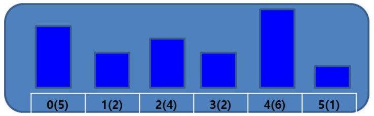

# 1. 건물옥상정원
## 1.1. 문제설명
- 건물 옥상에 정원을 만드는게 유행이다
- 정원에서 다른 건물 정원을 보던 연구원 이승훈은 궁금증이 생겼다
- 각 건물 옥상 정원에서 다른 건물 옥상 정원을 얼마나 볼 수 있는지 궁금하다

## 1.2 건물 정보
1. 건물은 일렬로 정렬되어 있으며 N개가 있음. N은 6 이상 80,000 이하임
2. 각 건물의 높이 H는 1 이상 1,000,000,000 이하임
3. 각 건물에 한 사람씩 있고, 동쪽만 바라본다고 가정하며, 건물 정보는 서쪽에서 동쪽 순으로 입력됨

## 1.3 계산시 주의사항
1. 동쪽을 바라보기 떄문에 i위치에 있는 건물에서는 i+1, i+2, ..., N-1 건물만 볼 수 있으며, 자기 건물 높이보다 낮은 건물의 옥상만 볼 수 있음
2. 건물 높이가 같거나 높은 건물이 있으면 그 건물 옥상뿐 아니라 그 뒤에 위치한 모든 건물 옥상은 볼 수 없음

## 1.4. 문제
### 1.4.1 입력 예시
- 입력 1의 입력 정보는 다음 표와 같다

</img>
  - 0번 건물에서는 1, 2, 3번 건물의 옥상을 볼 수 있음
  - 1번 건물에서는 어떤 건물의 옥상도 볼 수 없음
  - 2번 건물에서는 3번 건물의 옥상을 볼 수 있음
  - 3번 건물에서는 어떤 건물의 옥상도 볼 수 없음
  - 4번 건물에서는 5번 건물의 옥상을 볼 수 있음
  - 5번 건물에서는 볼 수 있는 건물 옥상이 없음
  - 각 건물에서 볼 수 있는 옥상의 총 합은 3 + 0 + 1 + 0 + 1 + 0 = 5 임

- 건물 개수 N과 각 건물의 높이가 주어졌을 때, 각 건물에서 볼 수 있는 옥상의 총 합을 구하시오

### 1.4.2. 입력 형식
- 첫 번째 줄에 건물 개수 N이 입력됨.
- 두 번째 줄부터 N줄에 걸쳐 각 건물의 높이 H가 입력됨. 서쪽 부터 동쪽 순으로 입력됨.

### 1.4.3. 출력 형식
- 각 건물에서 볼 수 있는 옥상의 총 합을 출력

입력
<pre>
<code>
6
5
2
4
2
6
1
</code>
</pre>

출력
<pre>
<code>
5
</code>
</pre>

## 1.5 Code
<pre>
<code>
n = int(input())
array = []

for _ in range(n):
    array.append(int(input()))

# i번째 건물을 볼 수 있는 건물들만 남겨서
# 마지막에 저장된 요소부터 차례로 비교해서 볼 수 있는 건물들만 남김
# LIFO 자료구조 스택을 이용

stack = []
sum = 0
for i in range(n):
    while len(stack) !=0 and stack[-1] <= array[i]:
        stack.pop()
    sum += len(stack)
    stack.append(array[i])
print(sum)

# Timeout 시간 복잡도 O(N^2) -> N이 80,000 이하이므로 시간 초과 발생!!
# tb = [0] * n
# for i in range(n):
#     for j in range(i + 1, n):
#         if array[i] > array[j]:
#             tb[i] += 1
#         else:
#             break
# print(sum(tb))
</code>
</pre>