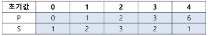
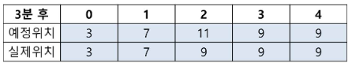

# 11. 산책
## 11.1. 문제 설명
- 직원들의 건강을 위해 점심 식사 후 산책을 하기로 했다.
- 산책로는 좁기 때문에 다른 사람을 추월할 수 없어서 그룹이 만들어지는데 몇 개의 그룹이 만들어 지는지 알아보려고 한다.

## 11.2. 요구 사항
- 모든 직원이 동시에 출발하고 출발 위치는 직원마다 다르며, 산책 속도는 직원 별로 같거나 다를 수 있다. 산책은 총 T분 동안 진행되는데 산책로가 좁기 때문에 다른 사람을 추월할 수 없어서 그룹이 형선된다.

### [값 범위]
1. 직원 수 N은 1 이상 100,000 이하
2. 산책 시간 T는 1 이상 1,000,000,000 분 이하
3. 직원 i번의 출발 위치 Pi는 0 이상 1,000,000,000 이하
4. 직원 i번의 산책 속도 Si는 0 이상 1,000,000,000 이하

- 산책로가 하나 밖에 없고 좁아서 다른 직원을 추월할 수 없다. 그래서 다 빠른 직원이 다른 직원을 따라 잡았을 떄, 추월하지 못하고 같은 속도로 산책할 수 밖에 없다(이때, 직원들이 한 줄로 길게 늘어지게 되지만 그냥 같은 위치에 있는 것으로 취급함, 아래 설명 참조). 즉, 그룹이 만들어지게 된다. T분 후에 같은 위치에 있어도 같은 그룹이다.

- 입력 1에서 5명의 직원이 3분동안 산책을 하면,

    </img>

- 다음 표와 같이 3 그룹이 형성된다.

    </img>

- 그룹 1은 0번 직원으로 3위치에 있으며, 그룹 2는 1번 직원으로 7위치에 있고, 그룹 3은 2, 3, 4번 직원으로 9위치에 있다.
- 2번 직원은 2 + 3 * 3 = 11위치까지 갈 수 있지만 앞 직원이 9위치까지만 갈 수 있으므로 같은 그룹이 된다.

## 11.3. 문제
- 직원 수 N과 산책 시간 T, 그리고 각 직원의 출발 위치와 속도가 주어졌을 떄, T분 후에 형성되는 그룹의 수를 계산하시오.

### <입력 형식>
- 첫 번째 줄에는 직원의 수 N과 산책시간 T가 공백으로 구분되어 입력
- 두 번째 줄에는 N줄에 걸쳐 각 직원의 출발 위치 Pi와 산책 속도 Si가 공백으로 구분되어 입력(출발 위치 오름차순으로 입력)

### <출력 형식>
- T분 후 형성되는 그룹의 수를 출력

- 예시 1
입력 
<pre>
<code>
5 3
0 1
1 2
2 3
3 2
6 1
</code>
</pre>

출력
<pre>
<code>
3
</code>
</pre>

## 11.4 Code
- 나의 코드 (TestCase 통과)
<pre>
<code>
# 산책
N, T = map(int, input().split())
PS= []

for _ in range(N):
	temp = tuple(map(int, input().split()))
	PS.append(temp)

# print(N, T)
# print(PS)
PS.sort(reverse = True)
# print(PS)

result = []

for p, s in PS:
	result.append(p + (s * T))
	
# print(result)	
	
for i in range(len(result)):
	if i != 0 and result[i-1] < result[i]:
		result[i] = result[i-1]

# print(result)
result = set(result)
# print(result)
print(len(result))
</code>
</pre>

- 정답 코드
<pre>
<code>
# 정방향 탐색 + 그룹의 선두를 Stack을 통해서 관리
import sys
read = sys.stdin.readline

N, T = map(int, read().split())
PS = []
for _ in range(N):
	temp = tuple(map(int, read().split()))
	PS.append(temp)

stack = []
for i in range(N):
    pos = PS[i][0] + T * PS[i][1]
    while stack and stack[-1] >= pos:	# stack - top : stack[-1]
        stack.pop()
    stack.append(pos)
print(len(stack))
</code>
</pre>

## 11.5 문제해결 아이디어
### [나의 아이디어]
- 출발 위치 내림차순으로 정렬
- T분 후 갈 수 있는 최대 위치를 각각 계산
- 각각 계산된 최대위치를 앞에서부터 선형 순회하여 앞선 데이터보다 앞선 위치일 경우, 앞선 데이터로 보정
- 중복된 데이터(위치) Set으로 제거 후, 최종 남은 Len(그룹의 수) 출력

### [정답 아이디어]
- 정방향으로 탐색
- 예상위치를 Stack에 넣어 Stack값과 다음 예상위치를 비교한다
	- Stack최상단과 비교를통해 선두를 갱신한다.