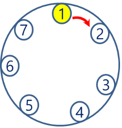
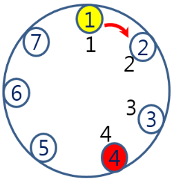
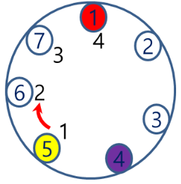
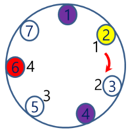

# 1. 장기자랑
## 1.1. 문제설명
- 전 직원 야유회 날이다. 전통적인 행사가 있는데 전 직원이 둥글게 둘러 앉아서 모든 직원이 돌아가면서 장기 자랑을 하는 것이다. 신입 사원 이승훈은 한 가지를 준비했는데 다른 직원이 먼저 할까봐 걱정이다.
  그래서 직원들의 장기자랑 순서를 계산해 보려고 한다.

## 1.2. 요구사항
- 장기 자랑 순서를 정하는 방법이 독특하다. **N명의 직원이 둥글게 둘러 앉아 있고 임의의 한 직원 S번 부터 시계방향으로 순서를 세어 나가서 M번째 직원이 장기 자랑**을 한다.
- N-1명이 남게 되는데, **장기 자랑한 그 다음 직원부터 순서를 세어 나가서 M번째 직원이 장기 자랑**을 하게 된다. 이런 식으로 순서를 정하게 된다.
- 편의상 직원 번호는 1번 부터 N번까지 순서대로 둥글게 둘러 앉아 있다고 하자. N번 옆 자리에 1번 직원이 앉아 있게 된다.

## 1.3. 문제
### 1.3.1 예시
- 예를 들어, 직원 수 N=7명이고 시작 직원 번호 S=1번이며 M은 4라고 할 경우, 장기 자랑 순서는 아래 표와 같다.

</img>
|장기자랑순서|1|2|3|4|5|6|7|
|:---:|:---:|:---:|:---:|:---:|:---:|:---:|:---:|
|직원 번호   |4|1|6|5|7|3|2|

- 자세히 설명하면, 1번 직원부터 세어서 4번째 직원인 4번 직원이 선택된다.

</img>
|장기자랑순서|1|2|3|4|5|6|7|
|:---:|:---:|:---:|:---:|:---:|:---:|:---:|:---:|
|직원 번호   |4|||||||

- 두 번째 순서는 장기자랑을 한 4번 직원의 다음 직원인 5번 직원부터 센다.

</img>
|장기자랑순서|1|2|3|4|5|6|7|
|:---:|:---:|:---:|:---:|:---:|:---:|:---:|:---:|
|직원 번호   |4|1||||||

- 세 번째 순서는 장기자랑을 한 1번 직원의 다음 직원인 2번 직원부터 센다.

</img>
|장기자랑순서|1|2|3|4|5|6|7|
|:---:|:---:|:---:|:---:|:---:|:---:|:---:|:---:|
|직원 번호   |4|1|6|||||

- 위와 같은 방법으로 장기 자랑 순서가 결정된다.

### 1.3.2. 값 범위
- 직원 수 N (N=자연수, 1 <= N <= 10^4)
- 시작 직원 번호 S (S=자연수, 1 <= S <= N)
- M (M=자연수, 1 <= M <= N)

직원 수 N과 시작 직원 번호 S, 그리고 M이 주어졌을 때, 장기 자랑 순서를 구하시오.

### 1.3.3. 입력 형식
- 첫 번째 줄 직원 수 N (N=자연수, 1 <= N <= 10^4)과 시작 직원 번호 S (S=자연수, 1 <= S <= N), 그리고 M (M=자연수, 1 <= M <= N)이 공백으로 구분되어 입력

### 1.3.4. 출력 형식
- 한 줄에 장기 자랑 순서를 차례대로 공백으로 구분하여 출력

입력
<pre>
<code>
7 1 4
</code>
</pre>

출력
<pre>
<code>
4 1 6 5 7 3 2 
</code>
</pre>

### 1.3.4. JAVA template
<pre>
<code>
import java.util.Scanner;

public class Main {
	int N;//직원 수
	int S;//시작 직원 번호
	int M;

	void InputData(){
		Scanner sc = new Scanner(System.in);
		N = sc.nextInt(); S = sc.nextInt(); M = sc.nextInt();
	}
	
	public static void main(String[] args) {
		Main m = new Main();
		m.InputData();//입력 함수
		
		//	코드를 작성하세요

	}
}
</code>
</pre>
