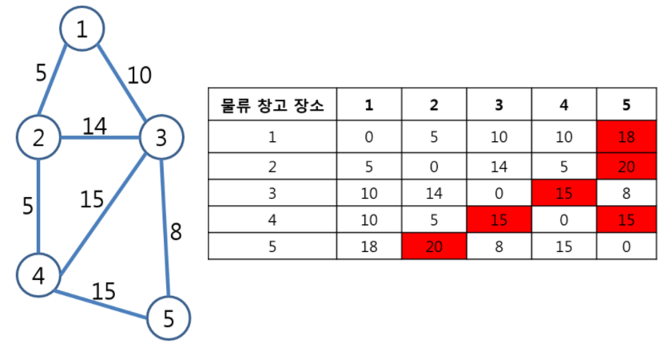

# 9. 물류 창고
## 9.1. 문제 설명
- 제품을 생산하는 N개의 공장 중 한 곳에 물류 창고를 지어서 제품을 관리할 예정이다. 제품을 신속하게 물류 창고로 옮겨야 하기 때문에 공장과 물류 창고 거리가 가까울수록 좋다. 물류 창고와 가장 먼 공장과의 거리가 최대한 가깝게 되는 장소에 물류 창고를 지으려고 한다.

## 9.2. 요구 사항
- 공장과 공장 사이에 최대 1개의 도로가 있을 수 있고, 양방향 도로이다. 제품의 이동은 도로를 이용해서만 이동이 가능하며 최단 거리로 이동을 한다. 최단 거리라 함은 A공장에서 B공장으로 이동할때, A->B로 직접 가는 것보다 A->C->B로 가는 것이 더 짧은 거리면 C공장을 거쳐서 이동하는 것이다.

### [값 범위]
1. 공장 수 N (N = 자연수, 5 <= N <= 100)
2. 도로 정보 수 M (M = 자연수, 5 <= M <= N * (N-1) / 2)
3. A공장에서 B공장 거리 D (A, B = 자연수, 1 <= A, B <= N), (D = 자연수,  1 <= D < = 100)
- 예를 들어, N = 5, M = 7이고, 도로 정보가 아래 그림과 같은 경우 : 

    </img>

- 빨간 색으로 표시된 부분이 각 장소에 물류 창고를 지었을 때, 물류 창고와의 거리가 제일 먼 공장이다. 행은 물류 창고 장소를 의미하고 열은 물류 창고와 해당 공장과의 거리를 의미한다.
- 1번 장소에 물류 창고를 지으면 5번 공장과의 거리가 18로 가장 멀고, 2번 장소에 지으면 5번 공장과의 거리가 20으로 가장 멀다. 5번 장소에 지으면 2번 공장과의 거리가 20으로 가장 멀다.
물류 창고를 3번이나 4번 공장에 지으면 제일 먼 공장과의 거리가 15로 다른 장소에 지었을 때보다 가깝게 된다.

## 9.3. 문제
- 공장 수 N과 도로 정보 수 M, 그리고 M개의 도로 정보가 주어졌을 때, 최적의 장소에 물류 창고를 지었을 때 가장 먼 공장과의 거리를 출력하시오.

### <입력 형식>
- 첫 번째 줄에는 공장 수 N (N = 자연수, 5 <= N <= 100) 과 도로 정보 수 M (M = 자연수, 5 <= M <= N * (N-1) / 2) 이 공백으로 구분되어 입력
- 두 번째 줄에는 M줄에 걸쳐 공장A (A = 자연수, 1 <= A <= N)와 공장B (B = 자연수, 1 <= B <= N) 와의 거리 D (D = 자연수,  1 <= D < = 100)가 공백으로 구분되어 입력 (양방향 도로이며 모든 공장은 연결됨을 보장함)

### <출력 형식>
- 최적의 장소에 물류 창고를 지었을 때, 가장 먼 공장과의 거리를 출력

입력
<pre>
<code>
5 7
1 2 5
3 2 14
2 4 5
1 3 10
4 3 15
5 4 15
3 5 8
</code>
</pre>

출력
<pre>
<code>
15
</code>
</pre>

## 9.4 Code
<pre>
<code>
INF = int(1e9)

N, M = map(int, input().split())

graph = [[INF] * (N + 1) for _ in range(N + 1)]

for a in range(1, N + 1):
    for b in range(1, N + 1):
        if a == b:
            graph[a][b] = 0

for _ in range(M):
    a, b ,c = map(int, input().split())
    graph[a][b] = c
    graph[b][a] = c # 양방향

# 플로이드 워셜 알고리즘
for k in range(1, N + 1):
    for a in range(1, N + 1):
        for b in range(1, N + 1):
            graph[a][b] = min(graph[a][b], graph[a][k] + graph[k][b])

maxlist = []
max = 0
for a in range(1, N + 1):
    for b in range(1, N + 1):
        if max < graph[a][b]:
            max = graph[a][b]
    maxlist.append(max)
    max = 0

print(min(maxlist))
</code>
</pre>

## 9.5 문제해결 아이디어
- 최단 경로 알고리즘 : 플로이드 워셜 알고리즘
    - 모든 노드에서 다른 모든 노드까지의 최단 경로를 모두 계산
    - 2차원 테이블에 최단 거리 정보를 저장
